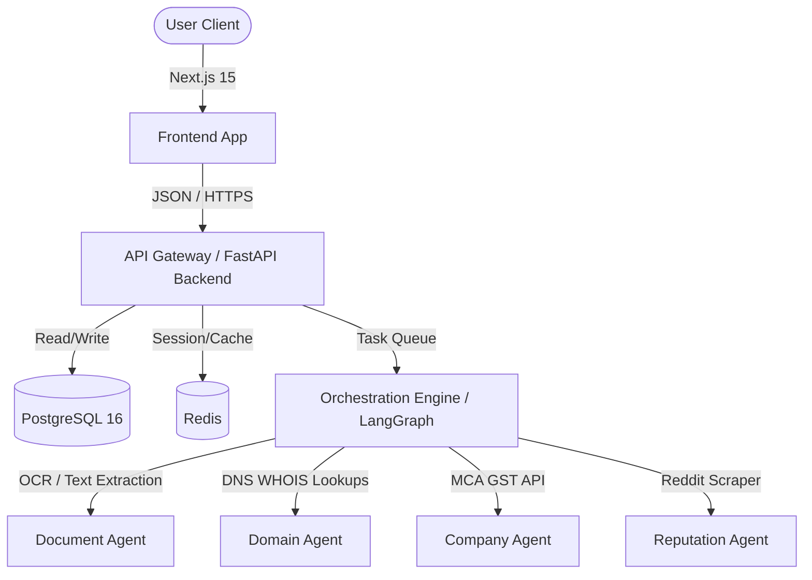
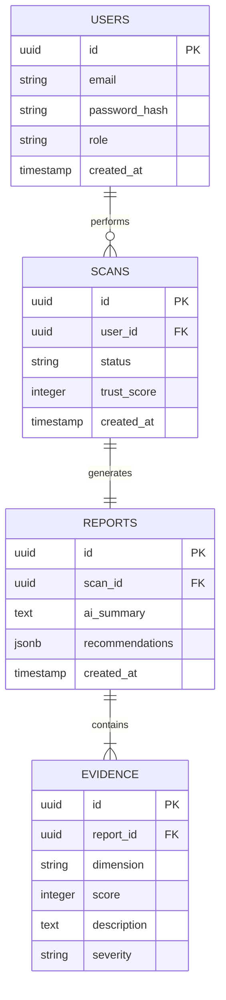
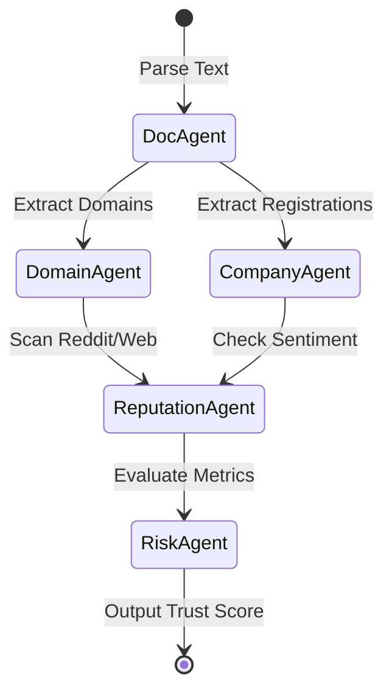

# LEGITIFY — Master Architecture Specification

## 1. Executive Summary
LEGITIFY is an AI-powered trust intelligence platform built to protect job seekers, students, and academic institutions from fraudulent job offers, mock recruiters, phishing domains, and fake internships. The system acts as an autonomous verification layer, scanning uploads and links, cross-checking government databases, running real-time domain lookups, and mining social channels (Reddit, Glassdoor) for community reputation.

---

## 2. Product Scope
### Input Formats
- **Files**: PDF, DOCX, TXT, images/screenshots
- **URLs**: Domain sites, recruiter LinkedIn URLs, job boards

### In-Scope Features
- Multi-Input Parser (OCR + NLP for document content)
- Domain Age & WHOIS Checker (SSL validation, creation dates)
- Company MCA/GST Registry Lookups
- Community Sentiment & Scraping (Reddit/Glassdoor keyword mapping)
- Recharts Trust Score Breakdown & Interactive Audit Timelines
- User Authentication (Student, Recruiter, Placement Admin roles)

---

## 3. User Personas
1. **Sanjay (21, engineering student)**: Verifies rapid-response remote internship offers.
2. **Priya (22, fresh graduate)**: Scans offer letters to check if the company is legitimate before sharing KYC docs.
3. **Dr. Ramesh (45, placement cell coordinator)**: Performs bulk scans on recruiters requesting campus access.
4. **Admin (platform administrator)**: Oversees system usage, false positives, and model metrics.
5. **Recruiter (legitimate employer)**: Submits company documents to receive a verification badge.

---

## 4. Technology Stack

| Layer | Technologies | Purpose |
|---|---|---|
| **Frontend** | Next.js 15, React 19, TS, Tailwind CSS v4, Framer Motion | User interface & portal |
| **Backend** | FastAPI, Python 3.12+, Uvicorn | High-performance modular API |
| **Database** | PostgreSQL 16, Redis | Persistence & caching layer |
| **AI Layer** | LangGraph, LlamaIndex, OpenAI GPT-4o | Orchestrating autonomous agents |
| **ML Models** | BERT (fine-tuned), XGBoost | Spam signature classification |
| **Deployment** | Docker, Docker Compose, GitHub Actions | Local & CI/CD pipeline |

---

## 5. System Architecture

---

## 6. Phased Build Strategy
- **Phase 0**: Architecture and SRS lock (Current)
- **Phase 1**: Frontend MVP (Next.js Interactive mock views)
- **Phase 2**: Backend API & DB (FastAPI + SQL Schema + Auth)
- **Phase 3**: Core Verification Engines (Domain WHOIS & MCA Scrapers)
- **Phase 4**: LangGraph Multi-Agent Workflows
- **Phase 5**: Risk Scoring ML Models
- **Phase 6**: Enterprise Scale & Vector Search (K8s, Milvus, Neo4j)

---

## 7. Database Architecture

---

## 8. API Architecture
- `POST /api/auth/register` (Register user)
- `POST /api/auth/login` (Generate access tokens)
- `POST /api/scans` (Upload PDF or URL for analysis)
- `GET /api/scans/{id}` (Check status of a running scan)
- `GET /api/reports/{id}` (Get trust score breakdown and timelines)

---

## 9. Microservices Architecture
Initially built as a modular monolith in Phase 1-2, the backend separates domains cleanly:
- `auth-service`: Handles registrations and JWT tokens.
- `scan-service`: Manages parsing and text routing.
- `verification-service`: Runs async WHOIS, MCA registry, and scrapers.
- `report-service`: Calculates scores and outputs JSON/PDF details.

---

## 10. AI Agent Architecture

---

## 11. Risk Scoring Engine
The Overall Trust Score $T$ is computed as a weighted average:

$$T = \sum (w_i \times S_i)$$

Where $S_i$ is the dimension score (0-100) and $w_i$ is the dimension weight:
- **Document Content ($w = 0.25$)**
- **Domain Age & SSL ($w = 0.20$)**
- **MCA/GST Verification ($w = 0.20$)**
- **Recruiter Profile Check ($w = 0.15$)**
- **Community Sentiment ($w = 0.10$)**
- **Technical/Headers ($w = 0.10$)**

---

## 12. Security Architecture
- Hashed passwords using `bcrypt`.
- Short-lived JWT access tokens + Redis-backed blacklist.
- strict role-based access control (RBAC): `student`, `recruiter`, `placement_cell`.
- Input validation on uploads (limiting file sizes to 10MB, strictly verifying mime types).

---

## 13. Frontend Architecture
Built with **Next.js 15** utilizing the App Router:
- `/` - Marketing & Hero
- `/dashboard` - User Overview
- `/scan` - Input interface (Dropzone + URL forms)
- `/report/[id]` - Trust score arc gauge & radar charts
- `/login` / `/register` - Auth gates

---

## 14. Deployment Architecture
- **Development**: Docker Compose spinning up `frontend`, `backend`, `postgres`, and `redis`.
- **Production (Enterprise)**: Kubernetes clusters, ingress controller, autoscaling, and monitoring with Prometheus + Grafana.

---

## 15. Development Standards
- **Naming**: camelCase in TS, snake_case in Python database models.
- **Formattings**: ESLint + Prettier (Frontend), Black + Ruff (Backend).
- **Git**: Feature branching, conventional commits (`feat:`, `fix:`, `chore:`).

---

## 16. Success Metrics
- **Performance**: Scan simulation processing under 15 seconds.
- **Quality**: False positive rate < 5%.
- **Retention**: Active user verification rate > 80%.

---

## 17. Risks & Mitigations

| Risk | Probability | Impact | Mitigation |
|---|---|---|---|
| Database rate-limiting (WHOIS, MCA) | High | Medium | Implement caching in Redis & proxy rotation |
| False Positives flagging real startups | Medium | High | Support prompt false-positive flags and human appeals |

---

## 18. Constraints & Assumptions
- Assumes valid public APIs or query accessibility for MCA registrar searches.
- Assumes stable internet connection to perform WHOIS lookups at the point of scan.

---

## 19. Future Enhancements
- Integration of a vector store (Milvus) for similarity checking against previously flagged templates.
- PDF generation microservice for printable certificate sharing.

---

## 20. Build Rules
1. Prioritize clean MVP layouts over infrastructure complexity.
2. Ensure strict type safety and component reusability.
3. Every page template must pass Next.js production builds.
