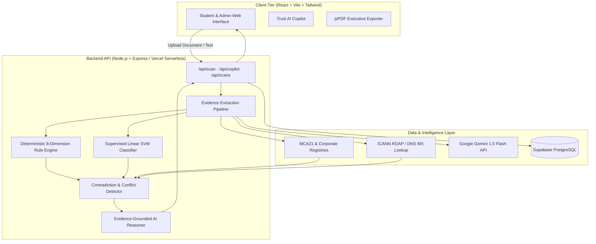

# LEGITIFY

> **Evidence-Based Recruitment & Internship Trust Intelligence Platform**

[](https://legitify.vercel.app)
[](https://www.typescriptlang.org/)
[](https://react.dev/)
[](https://vitejs.dev/)
[](https://tailwindcss.com/)
[](https://supabase.com/)
[](https://ai.google.dev/)
[](LICENSE)

---

## 🌐 Live Deployment & Domain
* **Official Web Application**: [https://legitify.vercel.app](https://legitify.vercel.app)
* **Custom Domain Mapping**: Compatible with `legitify.org` / `legitify.dev` via Vercel Custom Domains DNS (CNAME & A Records).

---

## 📖 Overview

**LEGITIFY** is an open-source risk intelligence platform designed to protect students, job seekers, and placement cells from fraudulent internships, employment scams, impersonation schemes, and predatory fee demands.

Rather than relying on generic AI opinions or simple text heuristics, LEGITIFY implements a **multi-dimensional, evidence-first forensic framework**. It correlates multi-source registry data, domain infrastructure records, document optical character recognition (OCR), supervised machine-learning models, and live web intelligence to deliver objective, audit-grade trust assessments.

### Key Problem Solved
Employment scams frequently exploit cognitive biases by impersonating reputable brands:
* **The Entity Confusion Trap**: Fraudsters use legitimate corporate names (e.g. IndiGo, TCS, Infosys) but communicate via public webmail (`@gmail.com`) or lookalike domains (`goindigohr.in`).
* **The Credential Illusion**: Fraudsters attach authentic third-party completion certificates or unverified registration seals to lend credibility to fake offers.
* **Predatory Fee Schemes**: Fraudulent recruiters demand candidate registration fees, laptop caution deposits, or training charges before joining.

LEGITIFY addresses this by decomposing every investigation into strictly distinct, independently verified entities.

---

## 🛡️ Core Principles

```
Document / Entity Input
         ↓
Multi-Source Evidence Extraction
         ↓
Deterministic Rule Engine & Registry Lookups
         ↓
Cross-Source Conflict & Contradiction Detection
         ↓
Supervised Machine Learning Risk Classification
         ↓
Evidence-Grounded AI Copilot & Explainable Report
```

1. **Evidence Precedes Judgment**: The system never classifies an opportunity without citing concrete, auditable Evidence Records (`E-001` through `E-006`).
2. **AI Is Not the Source of Truth**: Large Language Models (LLMs) are used strictly as reasoning synthesizers and evidence communicators over verified records, not as arbitrary deciders of truth.
3. **Preservation of Uncertainty**: Unverified data is explicitly marked as `UNVERIFIED` rather than assumed to be fake or genuine.
4. **Entity Separation**:
   * **Registered Company ≠ Authentic Recruiter** (A legal company may exist, but the recruiter may be an impersonator).
   * **Authentic Certificate ≠ Authentic Internship** (A valid training certificate does not make a deposit-demanding offer letter genuine).
   * **Real Company ≠ Authentic Offer Letter** (Legitimate trademarks are regularly copied onto fake appointment templates).

---

## 🔬 Multi-Dimensional Verification Capabilities

| Component | Forensic Checks Executed | Data Sources |
|---|---|---|
| **🏢 Company Registry** | Corporate Identification Number (CIN), active registration status, registered address, RoC jurisdiction | Ministry of Corporate Affairs (MCA21), Open Corporate Registries |
| **🌐 Domain & DNS** | Domain age, RDAP/WHOIS records, typosquatting/lookalike detection, MX mail exchangers | ICANN RDAP, Authoritative DNS, Google Safe Browsing |
| **👤 Recruiter Email** | Corporate domain alignment, free webmail detection (`@gmail`, `@yahoo`), SPF/DKIM verification | Mail Routing Inspection, DNS MX Validation |
| **📄 Document OCR** | Extraction of compensation terms, upfront fee clauses, caution deposits, training charges, HR signatory | PDF Parser, Tesseract OCR, Structural Text Miner |
| **📜 Certificate Analysis**| Credential verification URL, issuer existence, metadata consistency | Digital Registry Verification Engine |
| **🤖 Supervised ML** | Fraud probability estimation on recruitment phrasing, urgency keywords, payment demands | Linear SVM Classifier trained on Kaggle Recruitment Fraud Dataset |
| **🌎 Web Intelligence** | Multi-source public forum feeds, consumer complaint corroboration, official careers cross-check | Live Grounding, Community Discussion Repositories |

---

## 📋 Auditable Evidence Locker (`E-001` to `E-006`)

Every investigation generates a structured Evidence Locker embedded directly into the report:

| Evidence ID | Category | Default Source | Evaluation Tier | Verification Objective |
|---|---|---|---|---|
| **`E-001`** | `COMPANY_REGISTRY` | MCA21 / RoC Master Data | **AUTHORITATIVE** | Verifies legal existence and corporate standing of the organization. |
| **`E-002`** | `DOMAIN_FORENSICS` | ICANN RDAP / Authoritative DNS | **STRONG** | Detects lookalike domains, registration age, and MX record legitimacy. |
| **`E-003`** | `RECRUITER_EMAIL` | Mail Exchanger Inspection | **STRONG** | Identifies unlinked public webmail handles and sender impersonation. |
| **`E-004`** | `DOCUMENT_OCR` | Document Signal Extractor | **AUTHORITATIVE** | Flags upfront payment demands, registration fees, and caution deposits. |
| **`E-005`** | `COMMUNITY_FEEDS` | Public Forum Repositories | **COMMUNITY** | Corroborates independent user experiences and complaint patterns. |
| **`E-006`** | `SUPERVISED_ML` | Linear SVM (Kaggle v1.2) | **STRONG** | Statistically scores language urgency and structural fraud patterns. |

---

## 🤖 Evidence-Grounded Investigation Copilot

The built-in **Trust AI Assistant** is engineered as an investigative companion rather than a generic chatbot. It dynamically answers user inquiries grounded in the active scan's Evidence Locker:

* **Step-by-Step Guidance**: *"How do I verify this internship?"* $
ightarrow$ Outputs the 5-step verification checklist.
* **Entity Distinction**: *"Is the company itself fake?"* $
ightarrow$ Explains that the company is registered (`E-001`), but the specific offer is high risk due to payment demands (`E-004`).
* **Interrogation Generator**: *"Generate questions for the recruiter"* $
ightarrow$ Creates 5 formal verification questions (corporate careers URL, Employee ID, zero-fee confirmation).
* **Family Summary**: *"Explain this in 30 seconds for my parents"* $
ightarrow$ Generates a clear, non-technical safety summary citing the 1930 Cybercrime Helpline.
* **Challenge the Result**: Allows users to assert counter-claims, which the system cross-examines against conflicting evidence before recalculating.

---

## 👥 Role-Based Access Control (RBAC)

LEGITIFY implements segregated operational portals:

### 🎓 Candidate / Student Portal
* Authenticated securely via **Google Account (OAuth 2.0)**.
* **Document Scanner**: Multi-format support (PDF, PNG, JPG, Text, URL).
* **Executive Safety Report**: Modular breakdown with circular trust gauge, 3 dimension cards, red flags, risks & mitigation matrix, and evidence locker.
* **Court-Grade PDF Export**: 2-page printable report with cryptographic tamper-evident hashes.
* **Private Session**: Past scans database is restricted from general candidate view for privacy.

### 🛡️ Security Operations Center (Admin Portal)
* Restricted administrator access with multi-factor clearance verification.
* **Global Case Registry**: Access to full database history across all platform scans.
* **Live Pipeline Telemetry**: Real-time event streams, threat indicators, and system metrics.
* **Prediction Review & Override Tool**: SOC admins can review any case, adjust trust scores (0-100), override verdicts (`LIKELY GENUINE`, `SUSPICIOUS`, `LIKELY SCAM`), and persist forensic audit notes directly to Supabase.

---

## 🏗️ System Architecture



---

## 💻 Technology Stack

* **Frontend**: React 18, TypeScript, Vite, Tailwind CSS, Lucide Icons, Canvas Confetti
* **Backend**: Node.js, Express, TypeScript, Multer, Tsx
* **Database & Auth**: Supabase (PostgreSQL), Google OAuth 2.0
* **Machine Learning**: Supervised Linear SVM trained on Kaggle Job Scam Dataset v1.2
* **AI & Grounding**: Google Gemini 1.5 Flash API (`@google/genai`)
* **Document Processing**: pdf-parse, Tesseract OCR
* **PDF Generation**: jsPDF (A4 Executive Status Report Template)
* **Deployment**: Vercel Serverless Functions (`api/index.ts` + `vercel.json`)

---

## 🚀 Getting Started

### Prerequisites
* **Node.js**: v18.0.0 or higher
* **npm**: v9.0.0 or higher
* **Git**

### 1. Clone the Repository
```bash
git clone https://github.com/Shri-Sanjaykumar/LEGITIFY.git
cd LEGITIFY
```

### 2. Install Dependencies
```bash
npm install
```

### 3. Configure Environment Variables
Create a `.env.local` file in the root directory (refer to [`.env.example`](.env.example)):
```env
PORT=3001
VITE_API_URL=http://localhost:3001

# Google Gemini API
GEMINI_API_KEY=your_gemini_api_key_here
VITE_GEMINI_API_KEY=your_gemini_api_key_here

# Supabase Database & Auth
VITE_SUPABASE_URL=https://your-project.supabase.co
VITE_SUPABASE_ANON_KEY=your_supabase_anon_key
SUPABASE_SERVICE_ROLE_KEY=your_supabase_service_role_key
```

### 4. Run Development Server
```bash
npm run dev
```
* **Frontend Application**: [http://localhost:3000](http://localhost:3000)
* **Backend API Server**: [http://localhost:3001](http://localhost:3001)

### 5. Run Verification & Test Suite
```bash
npm run verify
```
Executes all 16 end-to-end test scenarios and compiles the production Vite bundle.

---

## ☁️ Vercel Deployment & Custom Domain Setup

### Deploying to Vercel (1-Click)
1. Push your code to your GitHub repository.
2. Navigate to [https://vercel.com/new](https://vercel.com/new).
3. Import the `LEGITIFY` repository.
4. Add the following **Environment Variables** in project settings:
   * `GEMINI_API_KEY`
   * `VITE_GEMINI_API_KEY`
   * `VITE_SUPABASE_URL`
   * `VITE_SUPABASE_ANON_KEY`
   * `SUPABASE_SERVICE_ROLE_KEY`
5. Click **Deploy**.

### Configuring a Custom Domain (e.g. `legitify.org`)
1. In your Vercel Project Dashboard, navigate to **Settings** $
ightarrow$ **Domains**.
2. Enter your domain name (e.g. `legitify.org` or `app.legitify.org`).
3. Add the DNS records provided by Vercel to your domain registrar (GoDaddy, Namecheap, Cloudflare):
   * **A Record**: `@` $
ightarrow$ `76.76.21.21`
   * **CNAME Record**: `www` $
ightarrow$ `cname.vercel-dns.com`
4. Vercel will automatically provision a free SSL/TLS certificate.

---

## 🧪 Test Coverage (16 Test Scenarios)

LEGITIFY includes comprehensive automated test suites covering core real-world cases:
* `TEST 1`: Verified company + Corporate domain + Valid certificate + No fee $
ightarrow$ **LOW RISK**
* `TEST 2`: Registered company + Recruiter Gmail + Upfront fee + Lookalike domain $
ightarrow$ **HIGH RISK**
* `TEST 3`: Authentic certificate + Suspicious opportunity $
ightarrow$ **Certificate: AUTHENTIC, Opportunity: HIGH RISK**
* `TEST 4`: Unknown certificate with unlisted registry $
ightarrow$ **UNVERIFIED (Not classified as fake)**
* `TEST 5`: Nonexistent company + Lookalike domain + Urgent UPI payment demand $
ightarrow$ **LIKELY SCAM**
* `TEST 6`: Single isolated public review $
ightarrow$ **Preserved as weak signal (No false positive escalation)**
* `TEST 7`: Multiple independent complaints detailing identical payment pattern $
ightarrow$ **STRONG COMMUNITY SIGNAL**
* `TEST 8`: Registered company + Impersonated domain $
ightarrow$ **Company: REGISTERED, Domain: SUSPICIOUS**

---

## ⚖️ Responsible Disclosure & Legal Notice

* **Educational & Risk Advisory Purpose**: LEGITIFY provides automated risk assessments based on available digital evidence. It does not replace formal legal counsel or official police investigations.
* **Zero Upfront Fees Standard**: In accordance with international recruitment conventions (ILO Fair Recruitment Initiative), legitimate corporate employers never charge candidate registration fees, security deposits, or onboarding charges.
* **Statutory Reporting**: Attempted employment fraud in India should be reported to the **National Cybercrime Helpline (1930)** or via **[cybercrime.gov.in](https://cybercrime.gov.in)** under Section 66D of the Information Technology Act.

---

## 📄 License
This project is licensed under the **MIT License** - see the [LICENSE](LICENSE) file for details.
