# LEGITIFY Backend Architecture Spec

This document specifies the backend system architecture for **LEGITIFY**, an enterprise-ready modular monolith built using **FastAPI** and **PostgreSQL**.

---

## 1. Directory Structure

The backend directory structure is organized logically to support clean separation of concerns, scalability, and ease of maintenance:

```
backend/
├── app/
│   ├── api/
│   │   ├── dependencies.py      # Common FastAPI dependencies
│   │   └── v1/
│   │       ├── auth.py          # Authentication handlers
│   │       ├── health.py        # Health & readiness checks
│   │       ├── report.py        # Report persistence
│   │       └── scan.py          # Upload and scan tracking
│   ├── core/
│   │   ├── config.py            # Pydantic v2 environment configuration
│   │   ├── logging.py           # Structured JSON log configuration
│   │   └── security.py          # Password hashing, JWT signing/rotation
│   ├── db/
│   │   ├── base.py              # Registering base models for Alembic import
│   │   ├── base_class.py        # Declarative Base with UUID primary keys
│   │   └── session.py           # SQLAlchemy AsyncEngine & AsyncSession managers
│   ├── middleware/
│   │   ├── logging.py           # Correlation ID & request timing logger
│   │   └── errors.py            # Global Exception Middleware
│   ├── models/
│   │   ├── audit.py             # Audit logs table
│   │   ├── file.py              # Uploaded files metadata
│   │   ├── report.py            # Scan report tables
│   │   ├── scan.py              # Scan status records
│   │   └── user.py              # User credentials, roles, sessions
│   ├── schemas/
│   │   ├── auth.py              # Login/register request/response validation
│   │   ├── base.py              # Generic envelope schemas
│   │   ├── file.py              # File metadata schema
│   │   ├── report.py            # Report detail schemas
│   │   └── scan.py              # Scan status schema
│   ├── services/
│   │   ├── auth.py              # Auth business logic
│   │   ├── file.py              # File extraction, validation, hashing
│   │   ├── scan.py              # Scan state and flow tracker
│   │   └── report.py            # Report creation and retrieval logic
│   └── main.py                  # Entrypoint for ASGI servers (Uvicorn)
├── alembic/                     # Database migrations folder
├── tests/                       # Pytest test suite
├── alembic.ini                  # Alembic database migration config
├── Dockerfile                   # Docker container builder
├── docker-compose.yml           # Local multi-service orchestrator
├── .env.example                 # Environment variable templates
└── requirements.txt             # Python package dependencies
```

---

## 2. API Design & Standardized Response Format

Every REST API response follows a consistent envelope format:

```json
{
  "success": true,
  "message": "Operation completed successfully.",
  "data": {},
  "errors": [],
  "request_id": "9b1deb4d-3b7d-4bad-9bdd-2b0d7b3dcb6d"
}
```

* **`success`**: Boolean indicating the operation outcome.
* **`message`**: A user-friendly message describing the operation.
* **`data`**: Payload returned by the endpoint (varies per endpoint).
* **`errors`**: Array of structured error messages in case of failures.
* **`request_id`**: A UUID generated per request to trace execution logs.

---

## 3. Request Lifecycle

The backend processes API requests through multiple layers:

```mermaid
graph TD
    Client[Client Request] --> ReqID[Request ID Middleware]
    ReqID --> Logger[Structured Logging Middleware]
    Logger --> Router[FastAPI Router /api/v1]
    Router --> Dep[Dependency Injection: DB Session, Auth User]
    Dep --> Service[Service Layer: Business Rules]
    Service --> Repo[Repository Layer: DB Access]
    Repo --> DB[(PostgreSQL)]
    Service --> Envelope[Standardized JSON Envelope]
    Envelope --> Client
    
    style DB fill:#1e1e38,stroke:#6366f1,stroke-width:2px;
```



1. **Request ID Middleware**: Automatically extracts the `X-Request-ID` or `X-Correlation-ID` header, or generates a new UUID. This ID is appended to the FastAPI request context.
2. **Logging Middleware**: Logs the incoming request method, path, and client IP. Automatically tracks duration and logs the status code upon completion.
3. **API Router**: Directs traffic to specific endpoint handlers.
4. **Dependencies**: Resolves validation requirements, injects database sessions, and verifies user authorization.
5. **Services**: Orchestrates business workflows (e.g. validates magic bytes of an uploaded file, creates scan entries).
6. **Repository Layer**: Interfaces with PostgreSQL using SQLAlchemy.
7. **Global Error Middleware**: Catch-all handler that translates uncaught exceptions into the standard JSON error envelope with appropriate HTTP status codes.

---

## 4. Observability Spec

### JSON Structured Logging
All application logs are printed in JSON format. This enables high-performance parsing by log aggregators (e.g., ElasticSearch, Loki):

```json
{
  "timestamp": "2026-06-15T16:30:12Z",
  "level": "INFO",
  "message": "User registered successfully",
  "request_id": "9b1deb4d-3b7d-4bad-9bdd-2b0d7b3dcb6d",
  "user_id": "4a24c18f-a9cb-4bb3-b09e-7117c76899aa",
  "duration_ms": 142.3
}
```

### Audit Logging (Immutable DB Trail)
All key actions (e.g., logins, file uploads, score modification) write an immutable record in the `audit_logs` table:
* **`id`**: UUID primary key.
* **`action`**: e.g., `USER_LOGIN`, `FILE_UPLOAD`, `SCAN_STATUS_UPDATE`.
* **`user_id`**: UUID reference of the actor.
* **`ip_address`**: Client network address.
* **`payload`**: JSON payload for historical diff checking.
* **`created_at`**: Creation timestamp.
