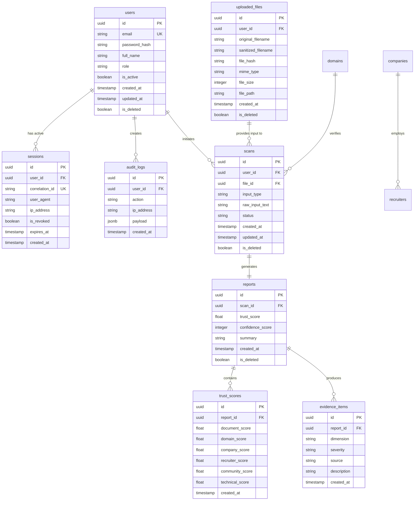

# LEGITIFY Database Specification

This document specifies the PostgreSQL relational database schema for **LEGITIFY**.

---

## 1. Entity Relationship Diagram (ERD)

---

## 2. Table Schemas

All primary keys in the system are **UUIDv4** types to support distributed, secure identifier generation.

### 2.1 Table: `users`
Persists user profile credentials, access states, and system authorizations.

* **Columns**:
  * `id`: `UUID` (PRIMARY KEY, Default: `uuid_generate_v4()`)
  * `email`: `VARCHAR(255)` (UNIQUE, NOT NULL, INDEXED)
  * `password_hash`: `VARCHAR(255)` (NOT NULL)
  * `full_name`: `VARCHAR(255)` (NOT NULL)
  * `role`: `VARCHAR(50)` (NOT NULL, Constraints: check in `('student', 'faculty', 'admin', 'investigator')`)
  * `is_active`: `BOOLEAN` (NOT NULL, Default: `true`)
  * `created_at`: `TIMESTAMP WITH TIME ZONE` (NOT NULL, Default: `CURRENT_TIMESTAMP`)
  * `updated_at`: `TIMESTAMP WITH TIME ZONE` (NOT NULL, Default: `CURRENT_TIMESTAMP`)
  * `is_deleted`: `BOOLEAN` (NOT NULL, Default: `false`)
* **Indexes**:
  * `idx_users_email` (btree: `email`)
* **Soft Delete Strategy**: Sets `is_deleted = true`. All fetch queries must include `WHERE is_deleted = false`.

---

### 2.2 Table: `sessions`
Persists active user login sessions, handling refresh token rotation tracking and blacklists.

* **Columns**:
  * `id`: `UUID` (PRIMARY KEY, Default: `uuid_generate_v4()`)
  * `user_id`: `UUID` (FOREIGN KEY references `users(id)`, ON DELETE CASCADE, NOT NULL)
  * `correlation_id`: `VARCHAR(255)` (UNIQUE, NOT NULL, INDEXED)
  * `user_agent`: `VARCHAR(512)` (NULLABLE)
  * `ip_address`: `VARCHAR(45)` (NULLABLE)
  * `is_revoked`: `BOOLEAN` (NOT NULL, Default: `false`)
  * `expires_at`: `TIMESTAMP WITH TIME ZONE` (NOT NULL)
  * `created_at`: `TIMESTAMP WITH TIME ZONE` (NOT NULL, Default: `CURRENT_TIMESTAMP`)
* **Indexes**:
  * `idx_sessions_correlation_id` (btree: `correlation_id`)

---

### 2.3 Table: `uploaded_files`
Metadata repository for document uploads, tracking size limits, MIME checks, and hashes.

* **Columns**:
  * `id`: `UUID` (PRIMARY KEY, Default: `uuid_generate_v4()`)
  * `user_id`: `UUID` (FOREIGN KEY references `users(id)`, ON DELETE SET NULL, NOT NULL)
  * `original_filename`: `VARCHAR(255)` (NOT NULL)
  * `sanitized_filename`: `VARCHAR(255)` (NOT NULL)
  * `file_hash`: `VARCHAR(64)` (NOT NULL, INDEXED) -- SHA-256
  * `mime_type`: `VARCHAR(128)` (NOT NULL)
  * `file_size`: `INTEGER` (NOT NULL)
  * `file_path`: `VARCHAR(512)` (NOT NULL)
  * `created_at`: `TIMESTAMP WITH TIME ZONE` (NOT NULL, Default: `CURRENT_TIMESTAMP`)
  * `is_deleted`: `BOOLEAN` (NOT NULL, Default: `false`)
* **Indexes**:
  * `idx_files_hash` (btree: `file_hash`)

---

### 2.4 Table: `scans`
Main record for initialized analysis runs, managing step states.

* **Columns**:
  * `id`: `UUID` (PRIMARY KEY, Default: `uuid_generate_v4()`)
  * `user_id`: `UUID` (FOREIGN KEY references `users(id)`, ON DELETE SET NULL, NOT NULL)
  * `file_id`: `UUID` (FOREIGN KEY references `uploaded_files(id)`, ON DELETE SET NULL, NULLABLE)
  * `input_type`: `VARCHAR(50)` (NOT NULL) -- check in `('pdf', 'docx', 'txt', 'url', 'linkedin', 'email', 'text')`
  * `raw_input_text`: `TEXT` (NULLABLE)
  * `status`: `VARCHAR(50)` (NOT NULL, Default: `'PENDING'`) -- check in `('PENDING', 'PROCESSING', 'COMPLETED', 'FAILED')`
  * `created_at`: `TIMESTAMP WITH TIME ZONE` (NOT NULL, Default: `CURRENT_TIMESTAMP`)
  * `updated_at`: `TIMESTAMP WITH TIME ZONE` (NOT NULL, Default: `CURRENT_TIMESTAMP`)
  * `is_deleted`: `BOOLEAN` (NOT NULL, Default: `false`)
* **Indexes**:
  * `idx_scans_user_id` (btree: `user_id`)
  * `idx_scans_status` (btree: `status`)

---

### 2.5 Table: `reports`
Aggregated outcome generated from completed scans.

* **Columns**:
  * `id`: `UUID` (PRIMARY KEY, Default: `uuid_generate_v4()`)
  * `scan_id`: `UUID` (FOREIGN KEY references `scans(id)`, ON DELETE CASCADE, NOT NULL, UNIQUE)
  * `trust_score`: `NUMERIC(5, 2)` (NOT NULL, check: `trust_score >= 0 AND trust_score <= 100`)
  * `confidence_score`: `INTEGER` (NOT NULL, check: `confidence_score >= 0 AND confidence_score <= 100`)
  * `summary`: `TEXT` (NOT NULL)
  * `created_at`: `TIMESTAMP WITH TIME ZONE` (NOT NULL, Default: `CURRENT_TIMESTAMP`)
  * `is_deleted`: `BOOLEAN` (NOT NULL, Default: `false`)
* **Indexes**:
  * `idx_reports_scan_id` (btree: `scan_id`)

---

### 2.6 Table: `trust_scores`
Persists scores broken down across 6 dimensions.

* **Columns**:
  * `id`: `UUID` (PRIMARY KEY, Default: `uuid_generate_v4()`)
  * `report_id`: `UUID` (FOREIGN KEY references `reports(id)`, ON DELETE CASCADE, NOT NULL, UNIQUE)
  * `document_score`: `NUMERIC(5, 2)` (NOT NULL)
  * `domain_score`: `NUMERIC(5, 2)` (NOT NULL)
  * `company_score`: `NUMERIC(5, 2)` (NOT NULL)
  * `recruiter_score`: `NUMERIC(5, 2)` (NOT NULL)
  * `community_score`: `NUMERIC(5, 2)` (NOT NULL)
  * `technical_score`: `NUMERIC(5, 2)` (NOT NULL)
  * `created_at`: `TIMESTAMP WITH TIME ZONE` (NOT NULL, Default: `CURRENT_TIMESTAMP`)

---

### 2.7 Table: `evidence_items`
Lists individual evidence pieces contributing to the risk calculation.

* **Columns**:
  * `id`: `UUID` (PRIMARY KEY, Default: `uuid_generate_v4()`)
  * `report_id`: `UUID` (FOREIGN KEY references `reports(id)`, ON DELETE CASCADE, NOT NULL)
  * `dimension`: `VARCHAR(50)` (NOT NULL)
  * `severity`: `VARCHAR(50)` (NOT NULL) -- check in `('low', 'medium', 'high', 'critical')`
  * `source`: `VARCHAR(100)` (NOT NULL)
  * `description`: `TEXT` (NOT NULL)
  * `created_at`: `TIMESTAMP WITH TIME ZONE` (NOT NULL, Default: `CURRENT_TIMESTAMP`)
* **Indexes**:
  * `idx_evidence_report_id` (btree: `report_id`)

---

### 2.8 Table: `audit_logs`
Immutable database audit trail for compliance.

* **Columns**:
  * `id`: `UUID` (PRIMARY KEY, Default: `uuid_generate_v4()`)
  * `user_id`: `UUID` (FOREIGN KEY references `users(id)`, ON DELETE SET NULL, NULLABLE)
  * `action`: `VARCHAR(100)` (NOT NULL, INDEXED)
  * `ip_address`: `VARCHAR(45)` (NOT NULL)
  * `payload`: `JSONB` (NULLABLE)
  * `created_at`: `TIMESTAMP WITH TIME ZONE` (NOT NULL, Default: `CURRENT_TIMESTAMP`)
* **Indexes**:
  * `idx_audit_action` (btree: `action`)
  * `idx_audit_created_at` (btree: `created_at`)

---

## 3. Future-Ready Entities (Schema-ready definitions)

The following tables are stubbed for upcoming verification layers:

### 3.1 Table: `companies`
* `id` UUID PK
* `name` VARCHAR
* `cin` VARCHAR (Corporate Identification Number)
* `gstin` VARCHAR
* `status` VARCHAR (Active/Inactive)
* `created_at` TIMESTAMP

### 3.2 Table: `domains`
* `id` UUID PK
* `domain_name` VARCHAR UK
* `creation_date` TIMESTAMP
* `expiry_date` TIMESTAMP
* `registrar` VARCHAR
* `has_valid_ssl` BOOLEAN
* `created_at` TIMESTAMP

### 3.3 Table: `recruiters`
* `id` UUID PK
* `company_id` UUID FK
* `linkedin_url` VARCHAR
* `email` VARCHAR
* `verification_status` VARCHAR
* `created_at` TIMESTAMP
