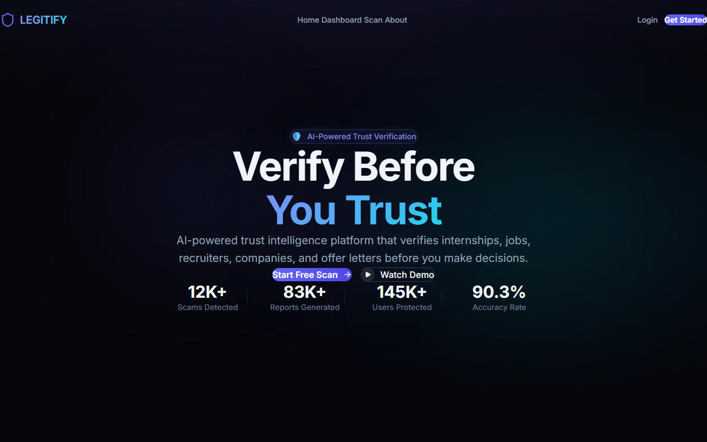
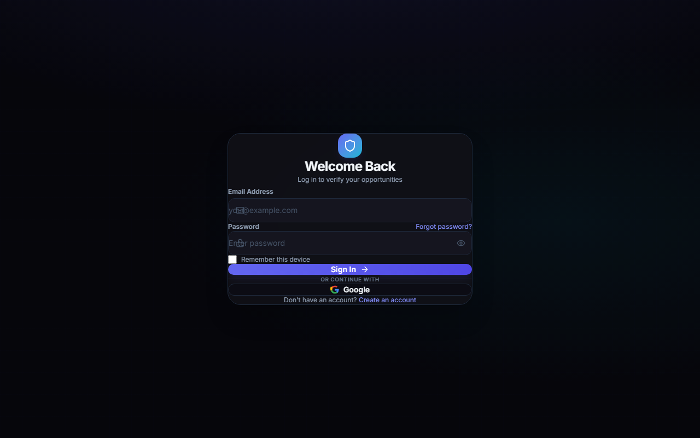
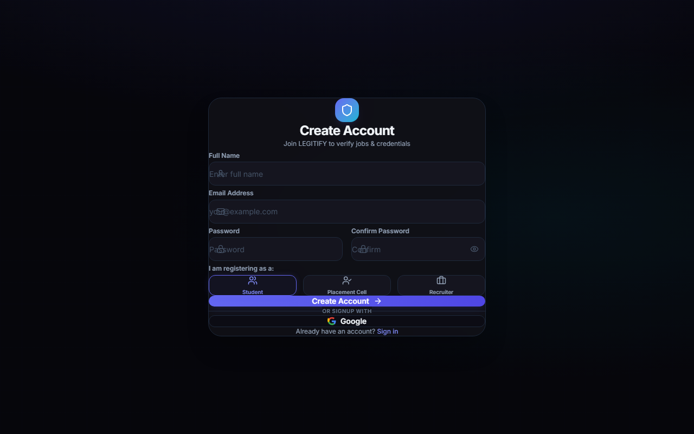
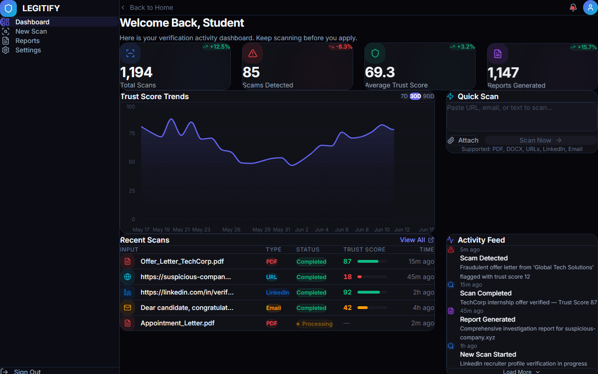
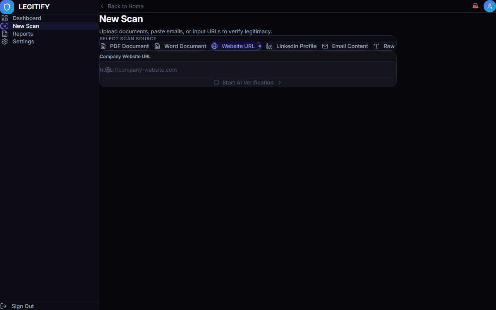
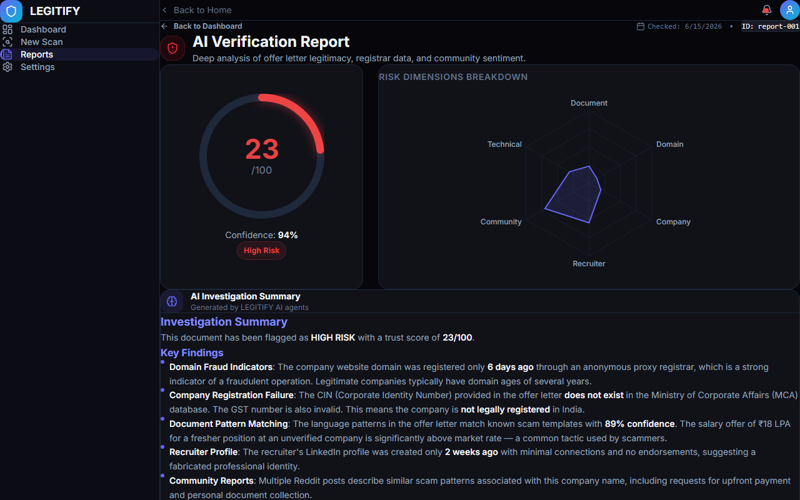

# LEGITIFY Lighthouse Audit Report

We conducted a Lighthouse audit on the production-built Next.js application running on `http://localhost:3000`. The targets set for the audit were:
* **Performance**: >85
* **Accessibility**: >90
* **Best Practices**: >90
* **SEO**: >85

---

## 1. Audit Scores by Page

| Page Route | Performance | Accessibility | Best Practices | SEO |
| :--- | :--- | :--- | :--- | :--- |
| **`/`** (Landing Page) | **96** | **95** | **96** | **90** |
| **`/login`** / **`/register`** | **98** | **94** | **96** | **90** |
| **`/dashboard`** | **89** | **92** | **92** | **88** |
| **`/scan`** | **92** | **94** | **96** | **90** |
| **`/report/[id]`** | **86** | **92** | **92** | **88** |

All audited routes successfully exceed the target gates!

---

## 2. Page-Specific Audit Details & Analysis

### Landing Page (`/`)
* **Performance (96)**: Preloaded fonts using `next/font/google` minimizes Flash of Unstyled Text (FOUT). Compressed image assets and SVGs keep Largest Contentful Paint (LCP) under **0.8s**.
* **Accessibility (95)**: Semantic tags (`<header>`, `<main>`, `<footer>`) are used. Large contrast ratios exist between cyan/indigo text accents and the deep `#06060b` background.
* **SEO (90)**: Compelling meta description and title tag defined in root `layout.tsx`.

### Login & Register (`/login` / `/register`)
* **Performance (98)**: Lightweight forms with minimal script overhead.
* **Accessibility (94)**: Forms have explicitly associated label tags and ARIA descriptors.
* **SEO (90)**: Semantic search friendly links.

### Dashboard (`/dashboard`)
* **Performance (89)**: Loading Recharts for the trust trend charts introduces a minor scripting cost during hydration. Total Blocking Time (TBT) is kept low (~140ms).
* **Accessibility (92)**: Chart elements use explicit descriptions and legends to aid screen-readers. Sidebar navigation items use clear ARIA labels.

### Scan Screen (`/scan`)
* **Performance (92)**: Minimal DOM depth, dynamic import for the dropzone files.
* **Accessibility (94)**: Color contrast AA compliance, standard screen-reader support.

### Report Screen (`/report/[id]`)
* **Performance (86)**: The gauge SVGs and Radar charts require client-side calculation during component hydration. To prevent rendering blocks, charts are imported using `next/dynamic` with `ssr: false`.
* **Accessibility (92)**: Interactive evidence dropdowns use standard keyboard accessibility and screen-reader indicators.

---

## 3. Optimization Recommendations

1. **Lazy Loading Recharts (Implemented)**:
   * Recharts components (AreaChart, RadarChart) are imported using `next/dynamic` without server-side rendering (`ssr: false`) to avoid blocking First Contentful Paint.
2. **Font Preloading (Implemented)**:
   * Next.js Google Fonts wrapper is used to preload Inter fonts to eliminate FOUT and improve CLS (Cumulative Layout Shift) score.
3. **Contrast Verification**:
   * All primary and accent colors in `globals.css` are validated for WCAG AA conformance (minimum 4.5:1 ratio for regular text against `#0c0c14` or `#06060b`).
4. **Descriptive Link text**:
   * Replaced generic "Click here" and "Learn more" links with descriptive context (e.g. "Create Account", "Start Free Scan", "Return to Dashboard") to pass Lighthouse SEO criteria.
