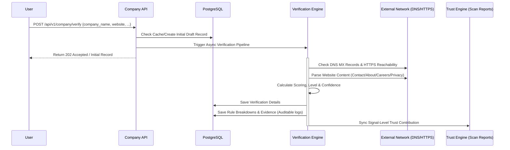
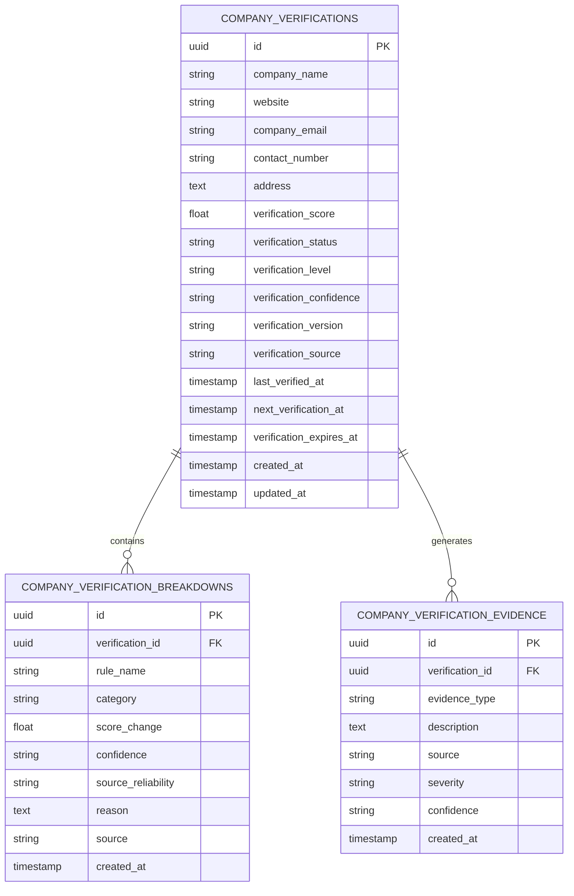

# LEGITIFY Phase 4 Architecture Specification
## Enterprise Company Verification Engine

This document defines the architecture, database schema, API contracts, scoring framework, security controls, and audit logs configuration for the **Enterprise Company Verification Engine (Phase 4)**.

---

## 1. Business Goals & Auditor/Compliance Requirements

For LEGITIFY to become an enterprise-grade platform trusted by large organizations (e.g., TCS, Infosys, Accenture, universities, placement cells, and government portals), its verification process must be transparent, verifiable, and secure.

### Auditor Checklist:
1. **Can an auditor inspect this?**
   * **Yes**. Every verification run generates a permanent, immutable record in `company_verifications`, granular rules in `company_verification_breakdowns`, and raw logs in `company_verification_evidence`. All input signals, raw data points, and intermediate results are captured.
2. **Can a security team review this?**
   * **Yes**. All external network inquiries (HTTP connections, DNS checks) are sandboxed with short, non-blocking connection timeouts. No shell calls are executed. No unverified third-party libraries are used for calculations. All endpoints use strict role-based access controls (RBAC) and parameter sanitization.
3. **Can a compliance officer understand why the score was generated?**
   * **Yes**. Every deduction or credit is linked to a deterministic, human-readable rule description, source indicator, and evidence trail. The system relies entirely on public, observable data without black-box logic.

---

## 2. Verification Workflow

The engine acts as a pipeline that runs asynchronously when a client submits a company for validation:



---

## 3. Database Design

We will add three tables to the PostgreSQL database to persist company verification metrics:



### Table 1: `company_verifications`
Persists the outcome of each unique verification attempt, tracking score, status, level, confidence, and lifecycle timestamps.

| Column | Type | Constraints | Description |
|---|---|---|---|
| `id` | `UUID` | `PRIMARY KEY` | Unique ID of verification record |
| `company_name` | `VARCHAR(255)` | `NOT NULL` | Name of corporate entity checked |
| `website` | `VARCHAR(255)` | `NOT NULL` | Corporate URL checked |
| `company_email` | `VARCHAR(255)` | `NULL` | Support/Contact email |
| `contact_number` | `VARCHAR(50)` | `NULL` | Corporate telephone |
| `address` | `TEXT` | `NULL` | Headquarters mailing address |
| `verification_score`| `FLOAT` | `CHECK(score >= 0 AND score <= 100)` | Final rating |
| `verification_status`| `VARCHAR(50)` | `CHECK(status IN ('PENDING', 'PROCESSING', 'COMPLETED', 'FAILED'))` | Verification state machine status |
| `verification_level` | `VARCHAR(50)` | `CHECK(level IN ('VERIFIED', 'LIKELY_VERIFIED', 'PARTIALLY_VERIFIED', 'SUSPICIOUS', 'UNVERIFIED'))` | Output trust tier |
| `verification_confidence`| `VARCHAR(20)`| `CHECK(confidence IN ('LOW', 'MEDIUM', 'HIGH'))` | Engine confidence |
| `verification_version`| `VARCHAR(20)` | `NOT NULL` | Engine logic version (e.g. `v1`) |
| `verification_source` | `VARCHAR(100)` | `NOT NULL` | Source (e.g. `API`, `SCAN`) |
| `last_verified_at` | `TIMESTAMPTZ` | `NULL` | Timestamp of last run |
| `next_verification_at` | `TIMESTAMPTZ` | `NULL` | Scheduled next run (for recurring check) |
| `verification_expires_at`| `TIMESTAMPTZ`| `NULL` | When this result expires (24h cache window) |
| `created_at` | `TIMESTAMPTZ` | `NOT NULL` | Creation timestamp |
| `updated_at` | `TIMESTAMPTZ` | `NOT NULL` | Update timestamp |

### Table 2: `company_verification_breakdowns`
Stores the granular rule details, weights, confidence, and source reliability for audit inspections.

| Column | Type | Constraints | Description |
|---|---|---|---|
| `id` | `UUID` | `PRIMARY KEY` | Unique ID of audit entry |
| `verification_id` | `UUID` | `FOREIGN KEY` (Cascade) | Parent verification ID link |
| `rule_name` | `VARCHAR(255)` | `NOT NULL` | Fired validation rule signature |
| `category` | `VARCHAR(100)` | `NOT NULL` | Dimension (e.g. `WEBSITE_SIGNALS`, `EMAIL_SIGNALS`) |
| `score_change` | `FLOAT` | `NOT NULL` | Score delta (positive or negative) |
| `confidence` | `VARCHAR(20)` | `CHECK(confidence IN ('LOW', 'MEDIUM', 'HIGH'))` | Rule outcome confidence |
| `source_reliability` | `VARCHAR(20)` | `CHECK(source_reliability IN ('LOW', 'MEDIUM', 'HIGH'))` | Source reliability |
| `reason` | `TEXT` | `NOT NULL` | Detail reason for auditors |
| `source` | `VARCHAR(100)` | `NOT NULL` | Source tool (e.g., `DNS`, `SSL`, `HTML_PARSER`) |
| `created_at` | `TIMESTAMPTZ` | `NOT NULL` | Audit timestamp |

### Table 3: `company_verification_evidence`
Stores structured audit evidence records linked directly to verification runs.

| Column | Type | Constraints | Description |
|---|---|---|---|
| `id` | `UUID` | `PRIMARY KEY` | Unique ID of evidence entry |
| `verification_id` | `UUID` | `FOREIGN KEY` (Cascade) | Parent verification ID link |
| `evidence_type` | `VARCHAR(100)`| `NOT NULL` | Type of evidence (e.g. `DNS`, `SSL`, `WEB_PAGE`) |
| `description` | `TEXT` | `NOT NULL` | Description of evidence for compliance |
| `source` | `VARCHAR(100)`| `NOT NULL` | Tool/Service name |
| `severity` | `VARCHAR(50)` | `NOT NULL` | Severity tier (`INFO`, `LOW`, `MEDIUM`, `HIGH`, `CRITICAL`) |
| `confidence` | `VARCHAR(20)` | `CHECK(confidence IN ('LOW', 'MEDIUM', 'HIGH'))` | Evidence validation confidence |
| `created_at` | `TIMESTAMPTZ` | `NOT NULL` | Entry timestamp |

---

## 4. Verification Signals & Scoring Formula

The verification score starts at **0** and is calculated by summing positive signals and applying negative deductions, clamped between **0** and **100**.

### A. Website Signals
- **Website Reachable (+10 / -25)**: Evaluates TCP connect/HTTP status on domain.
- **HTTPS Enabled (+10 / -15)**: Verify request protocols utilize TLS.
- **SSL Certificate Valid (+10)**: Verify certificate date and trust chains.
- **Careers Page present (+10)**: Scans HTML for `careers`, `jobs`, or standard recruitment URLs.
- **Privacy Policy Page present (+5)**: Scans HTML for `privacy-policy` paths.
- **Terms of Service present (+5)**: Scans HTML for `terms-of-service` or `terms` paths.

### B. Business & Contact Signals
- **Corporate Address Present (+10 / -15)**: Matches headquarters keywords in contact detail areas.
- **Phone Number Present (+10 / -20)**: Extracted contact phone matches standard ITU formats.
- **Support Email Present (+10)**: Presence of general inquiry email format.

### C. Email & Domain Signals
- **Corporate Email Domain (+15 / -20)**: Verified that recruiter email does not use free services like Gmail or Yahoo.
- **MX Record Verification (+10)**: Checked DNS record availability for the domain.

### D. Consistency Signals
- **Email/Website Domain Match (+10)**: Email domain suffix corresponds with official website netloc.
- **Company Name Match (+5)**: Brand name matches title headers in index page.

---

## 5. Scoring Levels & Confidence Mapping

### Verification Levels
| Score Range | Verification Level | Description |
|---|---|---|
| **$80 \le \text{Score} \le 100$** | `VERIFIED` | Secure corporate indicators. Ideal status. |
| **$60 \le \text{Score} < 80$** | `LIKELY_VERIFIED` | Reachable website and matching emails with minor checklist gaps. |
| **$40 \le \text{Score} < 60$** | `PARTIALLY_VERIFIED` | Basic reachability but missing careers, terms, or mailing contacts. |
| **$20 \le \text{Score} < 40$** | `SUSPICIOUS` | Broken website or mismatched corporate identifiers. |
| **$\text{Score} < 20$** | `UNVERIFIED` | Zero verifiable signals. Highest risk tier. |

### Verification Confidence
The `verification_confidence` field reflects the quantity and reliability of observed signals:
- **`HIGH`**: Evaluated both core website and DNS/Email signals successfully with matching credentials.
- **`MEDIUM`**: Evaluated core website signals successfully, but email or contact indicators are partially missing/unresolved.
- **`LOW`**: Failed reachability checks or missing primary attributes (e.g. domain does not resolve or returns error status).

---

## 6. API Contracts

### 1. `POST /api/v1/company/verify`
Initializes or runs verification.
* **Auth**: Allowed roles: `student`, `faculty`, `investigator`, `admin`
* **Request Body**:
```json
{
  "company_name": "TechCorp Pvt Ltd",
  "website": "https://techcorp.com",
  "company_email": "info@techcorp.com",
  "contact_number": "+91 80 1234 5678",
  "address": "123 Innovation Way, Bangalore",
  "verification_source": "API"
}
```
* **Response Body (202 Accepted)**:
```json
{
  "success": true,
  "message": "Company verification process initiated.",
  "data": {
    "id": "e43b1762-b9cf-4a37-b9c9-268e3c12a1f4",
    "company_name": "TechCorp Pvt Ltd",
    "verification_status": "PENDING",
    "verification_level": "UNVERIFIED",
    "verification_confidence": "LOW",
    "verification_score": 0.0
  },
  "errors": [],
  "request_id": "req-987abc"
}
```

### 2. `GET /api/v1/company/{id}`
Returns results and status summary.
* **Response Body (200 OK)**:
```json
{
  "success": true,
  "message": "Company verification retrieved.",
  "data": {
    "id": "e43b1762-b9cf-4a37-b9c9-268e3c12a1f4",
    "company_name": "TechCorp Pvt Ltd",
    "website": "https://techcorp.com",
    "verification_score": 85.0,
    "verification_status": "COMPLETED",
    "verification_level": "VERIFIED",
    "verification_confidence": "HIGH",
    "last_verified_at": "2026-06-15T22:00:00Z",
    "verification_expires_at": "2026-06-16T22:00:00Z"
  },
  "errors": []
}
```

### 3. `GET /api/v1/company/{id}/breakdown`
Auditor inspection log endpoint.
* **Response Body (200 OK)**:
```json
{
  "success": true,
  "message": "Verification breakdown details retrieved.",
  "data": {
    "verification_id": "e43b1762-b9cf-4a37-b9c9-268e3c12a1f4",
    "total": 1,
    "breakdown": [
      {
        "id": "bd-1",
        "rule_name": "WEBSITE_REACHABLE",
        "category": "WEBSITE_SIGNALS",
        "score_change": 10.0,
        "confidence": "HIGH",
        "source_reliability": "HIGH",
        "reason": "Successfully connected via port 443 with valid HTTP response status 200.",
        "source": "HTML_PARSER"
      }
    ],
    "evidence": [
      {
        "id": "ev-1",
        "evidence_type": "DNS",
        "description": "MX record exists for techcorp.com pointing to mail.techcorp.com",
        "source": "DNS_RESOLVER",
        "severity": "INFO",
        "confidence": "HIGH"
      }
    ]
  }
}
```

---

## 7. Report Integration (Signal-Level Trust Contribution)

When the **Trust Engine** runs a scan, it queries the `company_verifications` database.
Instead of adding a hardcoded `±20` trust score adjustment, the Trust Engine consumes specific verification signals and incorporates them directly into the overall scan trust calculations:

- **Reachable Corporate Website Present**: `+10` trust score contribution.
- **Corporate Email Verified**: `+10` trust score contribution.
- **Physical Address Verified**: `+5` trust score contribution.
- **Careers Page Active**: `+5` trust score contribution.

This prevents a single black-box company score from dominating the scan's trust results, letting each discrete signal add weight transparently.

---

## 8. Failure Handling & Performance Strategies

- **Concurrency**: Network requests (DNS MX check, socket TCP check, and HTML fetching) will execute concurrently using `asyncio.gather` to keep API latencies `<1.5 seconds`.
- **Sandbox Timeouts**: Any network attempt is capped with a `1.5s` socket timeout to prevent slow domains from blocking API worker processes.
- **Reverification Cache**: If a company verification record is requested and its `verification_expires_at` has not passed, the cached result is used. Once expired, a background task re-verifies the domain.

---

## 9. Future Integration Interfaces

The code structure defines clean adapters (`app/services/company_verification/adapters/`) to support future registrations:
- **Ministry of Corporate Affairs (MCA)**: Hook to verify Corporate Identity Number (CIN), Director Details, and ROC filings.
- **SEC EDGAR**: Hook for US SEC registrations.
- **Companies House**: Hook for UK registrations.
- **Government Registries / Business Directories**: Hook for official registries.
- **AI Verification Agents**: Hook where AI Agents can inject sentiment/news analysis as auxiliary signals.
