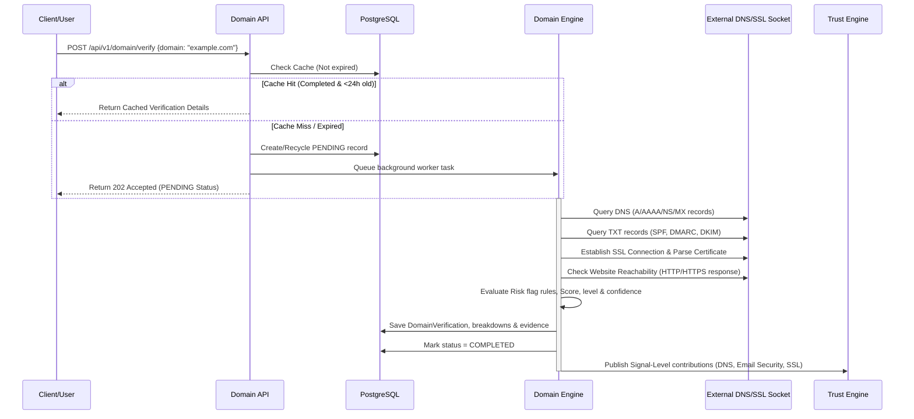

# LEGITIFY Phase 5 Architecture Specification
## Enterprise Domain Intelligence Engine

This document defines the architecture, database schemas, API contracts, scoring framework, security policies, and future threat intelligence hooks for the **Enterprise Domain Intelligence Engine (Phase 5)**.

---

## 1. Business Goals & Compliance Strategy

Most email spoofing, job scam campaigns, and recruitment fraud operations rely on:
1. **Fake/Disposable Domains**: Domains registered recently to spoof real brands or act as disposable links.
2. **Insecure Email Infrastructure**: Lack of SPF, DMARC, or DKIM settings, allowing anyone to send emails pretending to come from that domain.
3. **Misconfigured Security Records**: Invalid, expired, or self-signed SSL certificates, indicating lack of operational security or malicious infrastructure setups.

To protect candidates and university placement coordinators, the LEGITIFY Domain Intelligence Engine acts like a cybersecurity product, auditing the technical trustworthiness of domains used in:
- Job postings and internship offer documents (parsed URLs)
- Recruiter emails (parsed email domains)
- Company corporate websites

This engine evaluates the technical properties of the target domain deterministically, generating structured audit-ready logs for compliance checks.

---

## 2. Domain Verification Workflow

The verification pipeline runs asynchronously in the background. It utilizes DNS queries, mail exchanger (MX) verification, and SSL certificate queries with short timeouts to prevent system hangs.



---

## 3. Technical Core Architecture

### 3.1 DNS Architecture
- **Resolver Sandbox**: Run DNS resolutions using async-safe methods with low timeouts (e.g. `1.5s`).
- **Target Records**:
  - `A` / `AAAA` records: Verifies domain maps to IP addresses.
  - `NS` records: Confirms active nameservers.
  - `MX` records: Confirms capability to receive incoming emails.
- **Test Sandbox Mode**: Skip real resolver calls for localhost/test domains to allow fully isolated offline testing.

### 3.2 Email Security Architecture
- **SPF (Sender Policy Framework)**: Fetch `TXT` records matching `v=spf1`. Ensure no multiple SPF records (which invalidates SPF) and that rules are not excessively permissive (e.g., `+all`).
- **DMARC (Domain-based Message Authentication, Reporting, and Conformance)**: Query `TXT` record at `_dmarc.{domain}`. Parse policies (`p=none`, `p=quarantine`, `p=reject`) and verify reporting loops.
- **DKIM (DomainKeys Identified Mail)**: Although DKIM relies on selector prefixes (making wild lookups hard), the engine will look up common selectors (`default`, `google`, `mail`, `k1`, `sig1`) and provide hooks for selector-based audits.

### 3.3 SSL Validation Architecture
- **TLS Handshake Socket**: Establish a non-blocking TCP socket to port 443 with a custom SSL Context.
- **Certificate Parser**: Parse X509 certificate parameters:
  - Common Name (CN) and Subject Alternative Names (SANs) to match target domain name.
  - Issuer Name (checks for untrusted self-signed certificates).
  - Validity window (`notBefore` and `notAfter`). Calculate days remaining until expiry.
  - Certificate chain validation.

---

## 4. Risk Flag Framework & Scoring Model

### 4.1 Risk Flags
The engine evaluates and fires the following deterministic risk flags:
- `NO_DNS`: Domain does not resolve to any A/AAAA address. (HIGH severity deduction)
- `NO_MX`: No mail servers configured. Recruiter emails from this domain cannot receive replies. (HIGH severity deduction)
- `NO_SPF`: Missing SPF authorization record. (MEDIUM severity deduction)
- `NO_DMARC`: Missing DMARC email spoofing protection. (MEDIUM severity deduction)
- `NO_DKIM`: Missing DKIM records on common selectors. (LOW severity deduction)
- `SSL_INVALID`: Certificate domain name mismatch or invalid chain. (HIGH severity deduction)
- `SSL_EXPIRED`: SSL certificate validity has expired. (HIGH severity deduction)
- `WEBSITE_UNREACHABLE`: Domain is reachable on port 443 but returns broken HTTP status codes or timeouts. (MEDIUM severity deduction)
- `DOMAIN_EMAIL_MISMATCH`: Scan input uses mismatched contact emails vs the official web domains. (MEDIUM severity deduction)
- `INSECURE_CONFIGURATION`: Deprecated TLS protocols (SSLv3, TLS 1.0) enabled. (LOW severity deduction)

### 4.2 Scoring Formula
- **Base Score**: Starts at `100.0`.
- **Deductions**: Fired rules subtract points. Deductions are clamped: final score is strictly between `0.0` and `100.0`.
- **Level Mapping**:
  - `Score >= 80`: `VERIFIED`
  - `Score >= 60`: `LIKELY_VERIFIED`
  - `Score >= 40`: `PARTIALLY_VERIFIED`
  - `Score >= 20`: `SUSPICIOUS`
  - `Score < 20`: `UNVERIFIED`
- **Confidence Rating**:
  - `HIGH`: DNS, MX, and SSL parameters were successfully audited.
  - `MEDIUM`: DNS resolves, but SSL or MX audits failed due to timeouts.
  - `LOW`: DNS does not resolve, or complete timeout occurred.

### 4.3 Signal-Level Trust Engine Integration
No fixed company/domain level bonuses are allowed. Instead, the central Trust Engine consumes individual signal overrides:
- `DNS_HEALTHY` (+5.0)
- `EMAIL_SECURE_SPF_DMARC` (+10.0)
- `SSL_CERTIFICATE_VALID` (+10.0)
- Deductions from `NO_DNS` (-30.0), `NO_MX` (-25.0), and `SSL_INVALID` (-20.0) flow directly into report score breakdowns.

---

## 5. Database Schema Design

Three database tables will be created in PostgreSQL:

### 5.1 Table: `domain_verifications`
Tracks the primary outcome and cache lifecycle of each audited domain.

| Column Name | Type | Constraints | Description |
| :--- | :--- | :--- | :--- |
| `id` | `UUID` | `PRIMARY KEY` | Unique verification identifier |
| `domain` | `VARCHAR(255)` | `NOT NULL`, `INDEX` | The audited target domain name |
| `verification_score` | `FLOAT` | `NOT NULL`, `CHECK (0.0-100.0)` | Output rating |
| `verification_status` | `VARCHAR(50)` | `NOT NULL`, `CHECK` | State: `PENDING`, `PROCESSING`, `COMPLETED`, `FAILED` |
| `verification_level` | `VARCHAR(50)` | `NOT NULL` | Tier: `VERIFIED`, `LIKELY_VERIFIED`, etc. |
| `verification_confidence`| `VARCHAR(20)` | `NOT NULL` | Confidence: `LOW`, `MEDIUM`, `HIGH` |
| `dns_status` | `VARCHAR(50)` | `NOT NULL` | e.g. `RESOLVED`, `BROKEN` |
| `mx_status` | `VARCHAR(50)` | `NOT NULL` | e.g. `CONFIGURED`, `MISSING` |
| `spf_status` | `VARCHAR(50)` | `NOT NULL` | e.g. `VALID`, `MISSING`, `INVALID` |
| `dmarc_status` | `VARCHAR(50)` | `NOT NULL` | e.g. `VALID`, `MISSING`, `INVALID` |
| `dkim_status` | `VARCHAR(50)` | `NOT NULL` | e.g. `VERIFIED`, `UNKNOWN` |
| `ssl_status` | `VARCHAR(50)` | `NOT NULL` | e.g. `VALID`, `EXPIRED`, `INVALID` |
| `certificate_expiry` | `TIMESTAMPTZ` | `NULL` | Timestamp when SSL certificate expires |
| `last_verified_at` | `TIMESTAMPTZ` | `NULL` | Timestamp of last audit execution |
| `next_verification_at` | `TIMESTAMPTZ` | `NULL` | Recommended next check timestamp |
| `verification_expires_at`| `TIMESTAMPTZ` | `NULL` | Expiration of cache window (24h later) |
| `created_at` | `TIMESTAMPTZ` | `NOT NULL` | Creation timestamp |
| `updated_at` | `TIMESTAMPTZ` | `NOT NULL` | Update timestamp |

### 5.2 Table: `domain_verification_breakdowns`
Detailed rule-by-rule scoring breakdown logs for audit visibility.

| Column Name | Type | Constraints | Description |
| :--- | :--- | :--- | :--- |
| `id` | `UUID` | `PRIMARY KEY` | Unique breakdown record identifier |
| `verification_id` | `UUID` | `FOREIGN KEY` (Cascade) | Link to parent `domain_verifications.id` |
| `rule_name` | `VARCHAR(255)` | `NOT NULL` | Fired rule signature (e.g. `NO_SPF`) |
| `category` | `VARCHAR(100)` | `NOT NULL` | Category (e.g. `EMAIL_SECURITY`, `SSL_SIGNALS`) |
| `confidence` | `VARCHAR(20)` | `NOT NULL` | Confidence: `LOW`, `MEDIUM`, `HIGH` |
| `source_reliability` | `VARCHAR(20)` | `NOT NULL` | Reliability of source: `LOW`, `MEDIUM`, `HIGH` |
| `score_change` | `FLOAT` | `NOT NULL` | Score delta (positive/negative) |
| `reason` | `TEXT` | `NOT NULL` | Human-readable explanation for auditors |
| `source` | `VARCHAR(100)` | `NOT NULL` | Audit tool (e.g., `DNS_RESOLVER`, `SSL_SOCKET`) |
| `timestamp` | `TIMESTAMPTZ` | `NOT NULL` | Audit timestamp |

### 5.3 Table: `domain_verification_evidence`
Persists raw technical records, headers, and logs as verification proof.

| Column Name | Type | Constraints | Description |
| :--- | :--- | :--- | :--- |
| `id` | `UUID` | `PRIMARY KEY` | Unique evidence identifier |
| `verification_id` | `UUID` | `FOREIGN KEY` (Cascade) | Link to parent `domain_verifications.id` |
| `evidence_type` | `VARCHAR(100)` | `NOT NULL` | Type: `DNS`, `MX_RECORD`, `SSL_CERTIFICATE`, `TXT` |
| `severity` | `VARCHAR(50)` | `NOT NULL` | Severity: `INFO`, `LOW`, `MEDIUM`, `HIGH`, `CRITICAL` |
| `confidence` | `VARCHAR(20)` | `NOT NULL` | Confidence: `LOW`, `MEDIUM`, `HIGH` |
| `description` | `TEXT` | `NOT NULL` | Detailed technical audit log description |
| `source` | `VARCHAR(100)` | `NOT NULL` | Source check program name |
| `timestamp` | `TIMESTAMPTZ` | `NOT NULL` | Audit timestamp |

---

## 6. API Contracts

All endpoints return standardized JSON payloads including matching `request_id` headers.

### 6.1 `POST /api/v1/domain/verify`
Initiates a domain intelligence verify process or serves the active cache result.
- **Request Body**:
  ```json
  {
    "domain": "google.com",
    "verification_source": "API"
  }
  ```
- **Response (Cache Hit)**: `200 OK`
  ```json
  {
    "success": true,
    "message": "Domain verification retrieved from cache.",
    "data": {
      "id": "e5a40bcf-ef12-42da-9111-9a72d3f74991",
      "domain": "google.com",
      "verification_score": 95.0,
      "verification_status": "COMPLETED",
      "verification_level": "VERIFIED",
      "verification_confidence": "HIGH"
    }
  }
  ```
- **Response (Cache Miss)**: `202 Accepted`
  ```json
  {
    "success": true,
    "message": "Domain verification process initiated.",
    "data": {
      "id": "e5a40bcf-ef12-42da-9111-9a72d3f74991",
      "domain": "google.com",
      "verification_status": "PENDING"
    }
  }
  ```

### 6.2 `GET /api/v1/domain/{id}`
Returns the primary status summary of a verification run.
- **Response**: `200 OK`

### 6.3 `GET /api/v1/domain/history`
Returns paginated history of audited domains (supports searches, filtering by status or level).
- **Response**: `200 OK`

### 6.4 `GET /api/v1/domain/{id}/breakdown`
Returns detailed score breakdowns for auditors.
- **Response**: `200 OK`

### 6.5 `GET /api/v1/domain/{id}/evidence`
Returns raw evidence entries, certificates details, and DNS answers.
- **Response**: `200 OK`

---

## 7. Caching and Rate-Limiting Strategy
- **24-Hour Cache Enforcement**: The system checks for any `COMPLETED` entry of the target domain where `verification_expires_at > now()`.
- **Race Condition Prevention**: If a request comes in for a domain that is currently in `PENDING` or `PROCESSING` status, the API joins the existing job instead of starting a new crawler task.
- **Queue Rate Limiting**: Limit background threads to a maximum of 5 concurrent queries to protect target domains from request floods.

---

## 8. Frontend Component Design: `DomainIntelligencePanel`

The UI component will be built with premium aesthetics matching LEGITIFY's glassmorphic dark theme:
1. **Header Display**: Main domain label, verification score circular badge (color-graded: green/amber/rose), level badge, and confidence indicator.
2. **Security Indicators Grid**: A grid of status check boxes:
   - DNS Resolution Status
   - MX Record Configuration
   - SPF Validation Record
   - DMARC Policy Status
   - DKIM Selector Status
   - SSL Certificate State
3. **Audit Signal Breakdowns**: Expandable table details listing: Rule, Category, Confidence, Source Reliability, and Score Change (e.g. `-15.0`).
4. **Logged Evidence Items**: Auditable evidence logs mapping the exact DNS query answers and SSL certificate expiry parameters.
5. **Warnings & Recommendations**: Context-aware recommendations list based on security record deficiencies.

---

## 9. Future Cybersecurity Integrations Architecture

Although out-of-scope for the core Phase 5 engine build, the database schemas and code structures will expose standardized architecture hooks:
- **AbuseIPDB Integration Hook**: Hook inside the crawler pipeline to resolve the domain's server IP, check AbuseIPDB ratings, and subtract points if the server IP is flag-tagged for spam or attack vectors.
- **VirusTotal Integration Hook**: Hook to check the domain URL against VirusTotal malicious url databases.
- **AI Integration Hook**: Standardized model hooks allowing a future agent layer to read the structured evidence list, cross-reference registry anomalies, and write complex report summaries.

---

## 10. Quality Gates & Test Isolation
- **Mock-Locked Test Cases**: `test_domain_verification.py` will mock all `dns.resolver.resolve`, `socket.getaddrinfo`, and `ssl.SSLSocket` calls.
- **Target Metrics**: 95%+ code coverage, passing Black/Ruff linting, zero Mypy type errors, Next.js clean compilation, and Playwright E2E browser validations.
