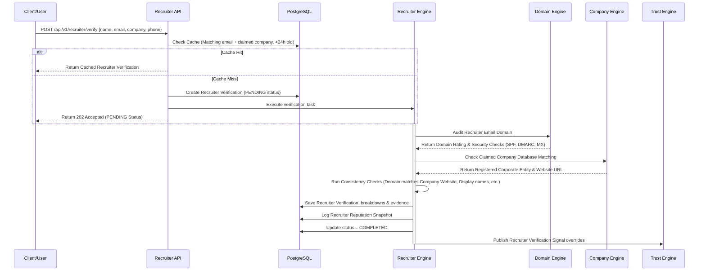

# LEGITIFY Phase 6 Architecture Specification
## Enterprise Recruiter Verification Engine

This document defines the system architecture, database models, API endpoints, scoring formulas, and frontend components for the **Enterprise Recruiter Verification Engine (Phase 6)**. This engine operates deterministically without LLMs or heuristic AI models to assess the legitimacy of recruiters, HR agents, and placement coordinators.

---

## 1. Business Goals & Compliance Strategy

Employment scams are a major threat to student placement cells, fresh graduates, and corporate recruiting teams. Fraud campaigns frequently impersonate reputable companies using:
1. **Lookalike or Free Recruiter Email Domains**: Using `john.doe@company-hr.com` (spoofed) or `microsoftrecruiter@gmail.com` to communicate.
2. **Display Name & Envelope Mismatches**: Sending email with "HR Recruiter" as the display name but linking to a generic external envelope or different `Reply-To` address.
3. **Mismatched Corporate Claims**: Claiming association with a Fortune 500 company while using a newly registered, parked, or unrelated domain.
4. **Mismatched Contact Channels**: Listing phone numbers or roles that are inconsistent with known company rosters.

The Recruiter Verification Engine acts as the final verification gate in LEGITIFY. It compares recruiter input (Name, Email, Phone, Company, Claims) against corporate verification records, domain intelligence, and structural consistency rules, outputting clean audit trails for university placement offices and security teams.

---

## 2. Recruiter Verification Workflow

The Recruiter Verification Engine operates as a sub-service. It receives a query containing recruiter name, email, claimed company name, phone, and optional job title, and processes it through a deterministic multi-step pipeline.



---

## 3. Verification Signals & Consistency Rules

The engine validates recruiter legitimacy using the following deterministic signals:

### 3.1 Email Domain Verification
- **Free Email Provider Check**: Identifies if the recruiter email uses a public/free email domain (e.g. `@gmail.com`, `@yahoo.com`, `@outlook.com`).
- **Domain Match Check**: Verifies if the email domain matches the official website domain of the claimed company (e.g., if claiming Microsoft, email domain must be `microsoft.com` or verified subdomains).
- **Reply-To Alignment Check**: Verifies if the `Reply-To` header (when analyzing raw email templates) matches the sending address domain.

### 3.2 Contact & Profile Verification
- **Phone Number Roster Check**: Verifies if the provided phone number matches known corporate registries or official contact channels.
- **Role Consistency Check**: Validates if the claimed title (e.g., "Talent Acquisition Coordinator") is consistent with standard recruitment roles.
- **Contact Channel Match**: Validates consistency between email domain, telephone area code, and company headquarters address.

---

## 4. Scoring, Level & Confidence Models

### 4.1 Scoring Formula
- **Base Score**: Starts at `100.0`.
- **Deductions**: Fired rules subtract points. Final score is strictly clamped between `0.0` and `100.0`.

| Rule Name | Severity | Deduction | Condition / Reason |
| :--- | :--- | :--- | :--- |
| `FREE_EMAIL_PROVIDER` | LOW | `-10.0` | Recruiter uses a free email provider (e.g. `@gmail.com`) (LOW confidence signal). |
| `FREE_EMAIL_AUTHORITY_MISMATCH` | HIGH | `-45.0` | Recruiter uses free email (e.g. `@gmail.com`) but claims authority from a major brand (e.g., Microsoft, Google, Amazon, TCS, Infosys). |
| `EMAIL_DOMAIN_MISMATCH` | CRITICAL | `-45.0` | Corporate email domain does not match the verified company domain (HIGH confidence). |
| `EMAIL_DOMAIN_MATCH_CREDIT` | HIGH | `+15.0` | Corporate email domain matches the company domain (HIGH confidence). |
| `REPLY_TO_MISMATCH` | HIGH | `-20.0` | Email envelope sender domain differs from the `Reply-To` address domain. |
| `DISPLAY_NAME_MISMATCH` | MEDIUM | `-15.0` | Display name (e.g., "Google HR") contradicts the email domain provider (e.g., `@unknown-host.com`). |
| `UNVERIFIED_CLAIMED_COMPANY` | HIGH | `-20.0` | Claimed company has not passed Legitify corporate verification or is marked suspicious. |
| `PHONE_ROSTER_MISMATCH` | LOW | `-5.0` | Phone contact does not match known corporate roster patterns or country codes. |

### 4.2 Verification Level Mapping
- **Score >= 80**: `VERIFIED`
- **Score >= 60**: `LIKELY_VERIFIED`
- **Score >= 40**: `PARTIALLY_VERIFIED`
- **Score >= 20**: `SUSPICIOUS`
- **Score < 20**: `UNVERIFIED`
- **Internal Suffix/Prefix**: `INTERNAL_RECRUITER` (Bypasses `UNVERIFIED` classification)

### 4.3 Confidence Rating
- **HIGH**: Claimed company is verified, email domain matches company website, and DNS/MX/SSL configurations are verified secure.
- **MEDIUM**: Claimed company is found, but recruiter uses a domain variation, or email parameters have partial configuration records.
- **LOW**: Claimed company is not found in corporate registries, or email domain uses a free provider without corroborating metadata.

### 4.4 Recruiter Evidence Log Codes
- `EMAIL_DOMAIN_MATCH`: Verified email domain matches claimed company domain.
- `FREE_EMAIL_PROVIDER`: Flags when recruiter communicates via free/public domains.
- `FREE_EMAIL_AUTHORITY_MISMATCH`: Flags free email claiming authority for major enterprise.
- `LINKEDIN_MATCH`: Verified LinkedIn profile placeholder fields resolved.
- `PHONE_MATCH`: Verified phone contact aligns with corporate headquarters pattern.
- `ROLE_VERIFIED`: Recruiter title is standard and active.
- `COMPANY_MATCH`: Claimed company has an active, verified entry in Legitify.

---

## 5. Database Schema Design

Four tables will be created in PostgreSQL:

### 5.1 Table: `recruiter_verifications`
Tracks the primary outcome and cache lifecycle of each recruiter validation query.

| Column Name | Type | Constraints | Description |
| :--- | :--- | :--- | :--- |
| `id` | `UUID` | `PRIMARY KEY` | Unique verification identifier |
| `recruiter_name` | `VARCHAR(255)` | `NOT NULL` | Full name of the recruiter |
| `recruiter_email` | `VARCHAR(255)` | `NOT NULL`, `INDEX` | Contact email address of the recruiter |
| `claimed_company` | `VARCHAR(255)` | `NOT NULL`, `INDEX` | Company name claimed by the recruiter |
| `recruiter_phone` | `VARCHAR(50)` | `NULL` | Optional contact phone number |
| `recruiter_role` | `VARCHAR(100)` | `NULL` | Claimed recruiter job title |
| `linkedin_profile_url` | `VARCHAR(500)` | `NULL` | LinkedIn profile placeholder (Future badge verification) |
| `linkedin_validation_status` | `VARCHAR(50)` | `NOT NULL`, `CHECK` | State: `UNKNOWN`, `VALID`, `INVALID` |
| `verification_score` | `FLOAT` | `NOT NULL`, `CHECK (0-100)` | Primary trust score outcome |
| `verification_status` | `VARCHAR(50)` | `NOT NULL` | State: `PENDING`, `PROCESSING`, `COMPLETED`, `FAILED` |
| `verification_level` | `VARCHAR(50)` | `NOT NULL` | Tier: `VERIFIED`, `LIKELY_VERIFIED`, etc. |
| `verification_confidence`| `VARCHAR(20)` | `NOT NULL` | Rating: `LOW`, `MEDIUM`, `HIGH` |
| `email_domain_status` | `VARCHAR(50)` | `NOT NULL` | e.g. `MATCHED`, `MISMATCHED`, `FREE_EMAIL` |
| `company_match_status` | `VARCHAR(50)` | `NOT NULL` | e.g. `FOUND_VERIFIED`, `FOUND_UNVERIFIED`, `NOT_FOUND` |
| `phone_match_status` | `VARCHAR(50)` | `NOT NULL` | e.g. `MATCHED`, `UNMATCHED`, `NOT_PROVIDED` |
| `last_verified_at` | `TIMESTAMPTZ` | `NULL` | Timestamp of last audit execution |
| `verification_expires_at`| `TIMESTAMPTZ` | `NULL` | Cache expiration timestamp (24h later) |
| `created_at` | `TIMESTAMPTZ` | `NOT NULL` | Record creation timestamp |
| `updated_at` | `TIMESTAMPTZ` | `NOT NULL` | Record update timestamp |

### 5.2 Table: `recruiter_verification_breakdowns`
Stores granular scoring adjustments applied by individual rules.

| Column Name | Type | Constraints | Description |
| :--- | :--- | :--- | :--- |
| `id` | `UUID` | `PRIMARY KEY` | Unique breakdown identifier |
| `verification_id` | `UUID` | `FOREIGN KEY`, `INDEX` | References `recruiter_verifications.id` |
| `rule_name` | `VARCHAR(255)` | `NOT NULL` | Fired rule (e.g. `FREE_EMAIL_PROVIDER`) |
| `category` | `VARCHAR(100)` | `NOT NULL` | Group (e.g. `EMAIL_SIGNALS`, `ROSTER_SIGNALS`) |
| `score_change` | `FLOAT` | `NOT NULL` | The score deduction/credit applied |
| `confidence` | `VARCHAR(20)` | `NOT NULL` | Confidence level of the rule |
| `source_reliability` | `VARCHAR(20)` | `NOT NULL` | Reliability of source metadata |
| `reason` | `TEXT` | `NOT NULL` | Human-readable explanation |
| `source` | `VARCHAR(100)` | `NOT NULL` | Source database or check (e.g. `EMAIL_PARSER`) |
| `timestamp` | `TIMESTAMPTZ` | `NOT NULL` | Log creation timestamp |

### 5.3 Table: `recruiter_verification_evidence`
Persists concrete audit evidence logs justifying scoring choices.

| Column Name | Type | Constraints | Description |
| :--- | :--- | :--- | :--- |
| `id` | `UUID` | `PRIMARY KEY` | Unique evidence identifier |
| `verification_id` | `UUID` | `FOREIGN KEY`, `INDEX` | References `recruiter_verifications.id` |
| `evidence_type` | `VARCHAR(100)` | `NOT NULL` | Code (e.g. `FREE_EMAIL_PROVIDER`, `ROLE_MATCH`) |
| `severity` | `VARCHAR(50)` | `NOT NULL` | Severity: `INFO`, `LOW`, `MEDIUM`, `HIGH`, `CRITICAL` |
| `confidence` | `VARCHAR(20)` | `NOT NULL` | Strength of signal |
| `description` | `TEXT` | `NOT NULL` | Audit description details |
| `source` | `VARCHAR(100)` | `NOT NULL` | Source tool (e.g., `TXT_EXTRACTOR`) |
| `timestamp` | `TIMESTAMPTZ` | `NOT NULL` | Evidence capture timestamp |

### 5.4 Table: `recruiter_reputation_snapshots`
Logs score histories for trend analysis.

| Column Name | Type | Constraints | Description |
| :--- | :--- | :--- | :--- |
| `id` | `UUID` | `PRIMARY KEY` | Unique snapshot identifier |
| `recruiter_email` | `VARCHAR(255)` | `NOT NULL`, `INDEX` | Recruiter contact email |
| `claimed_company` | `VARCHAR(255)` | `NOT NULL` | Company name checked against |
| `verification_score` | `FLOAT` | `NOT NULL` | Captured score rating |
| `verification_level` | `VARCHAR(50)` | `NOT NULL` | Captured level classification |
| `recruiter_verification_count` | `INTEGER` | `NOT NULL`, `DEFAULT 1` | How many times this recruiter has been verified |
| `recruiter_success_rate` | `FLOAT` | `NOT NULL`, `DEFAULT 1.0` | Ratio of VERIFIED/LIKELY_VERIFIED classifications |
| `captured_at` | `TIMESTAMPTZ` | `NOT NULL` | Timestamp of score capture |

---

## 6. API Contracts

### 6.1 `POST /api/v1/recruiter/verify`
Triggers recruiter audit, running background task if cache misses.

- **Request Body**:
```json
{
  "recruiter_name": "Jane Doe",
  "recruiter_email": "jane.doe@microsoft-recruitment.com",
  "claimed_company": "Microsoft",
  "recruiter_phone": "+1 415 555 2671",
  "recruiter_role": "Talent Specialist",
  "linkedin_profile_url": "https://linkedin.com/in/janedoe",
  "verification_source": "API"
}
```

- **Response (200 OK - Cache Hit)**:
```json
{
  "success": true,
  "message": "Recruiter verification retrieved from cache.",
  "data": {
    "id": "a9ef8540-12ab-4bc9-93ef-267ba8921cb4",
    "recruiter_name": "Jane Doe",
    "recruiter_email": "jane.doe@microsoft-recruitment.com",
    "claimed_company": "Microsoft",
    "linkedin_profile_url": "https://linkedin.com/in/janedoe",
    "linkedin_validation_status": "UNKNOWN",
    "verification_score": 60.0,
    "verification_status": "COMPLETED",
    "verification_level": "LIKELY_VERIFIED",
    "verification_confidence": "HIGH"
  },
  "request_id": "req-12345"
}
```

### 6.2 `GET /api/v1/recruiter/history`
Retrieves search audit history of verified recruiters.

### 6.3 `GET /api/v1/recruiter/{id}/breakdown`
Retrieves recruiter record detail along with breakdowns and evidence.

---

## 7. Frontend Panel Design

We will implement a premium dashboard component `RecruiterVerificationPanel.tsx`:
1. **Recruiter Identity Summary**: Score dial gauge, verification level status, and confidence levels.
2. **Email & Phone Grid**: Interactive grids displaying email domain checks, reply-to checks, free domain alerts, and phone number consistency indicators.
3. **Evidence Log**: Expanding rows listing technical audits, code reasons, severities, and source tools.
4. **Historical Reputation snapshots**: Small line chart displaying the shift in verification scores and verification count / success rate metrics.

---

## 8. Trust Engine Integration

The central Trust Engine will import recruiter verification signals directly:
- **Deduction Flow**: Individual breakdowns flow into the parent Trust Score.
- **Scam Clamping**: Clamps final risk level if severe email domain mismatches are detected.

---
