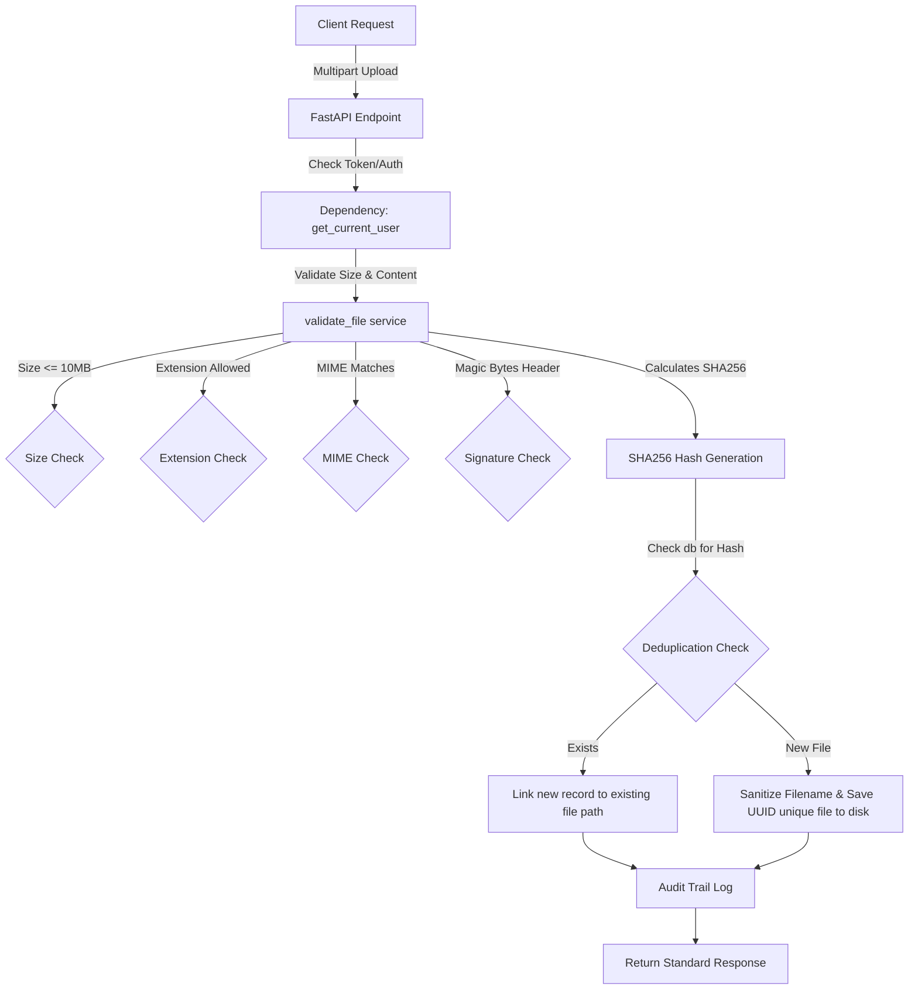

# Task 6 File Security and Integrity Review

This document provides a comprehensive security review of the File Upload and Storage subsystem for **LEGITIFY**.

---

## 1. Current Design

The file upload service is built with modular security validations and deduplication features. The current architecture ensures that files are handled in memory, validated strictly before storage, and processed with strong cryptographic integrity.

### Core Implementation Details
1. **Multi-Stage Validation**: 
   * **Size Limit**: Enforces a strict 10MB limit before reading files fully to prevent Denial of Service (DoS) memory consumption.
   * **MIME Verification**: Compares the reported MIME type against an allowed list (`application/pdf`, `application/vnd.openxmlformats-officedocument.wordprocessingml.document`, `text/plain`, `image/png`, `image/jpeg`).
   * **Extension Whitelist**: Only permits specific extensions, explicitly rejecting executable types (`.exe`, `.dll`, `.bat`, `.msi`, `.sh`, `.js`).
   * **Magic Bytes Verification**: Reads the file header bytes to confirm the contents match the extension signature.
2. **Deduplication Strategy**: Saves disk space and compute by hashing the content using SHA-256 and referencing the existing file record if a duplicate hash is detected.
3. **Evidence Integrity**: Saves standard evidence tracking fields (`sha256` value, `upload_timestamp` audit timestamp, `integrity_status` set to `VERIFIED`) to establish custody.
4. **Antivirus Infrastructure Ready**: Implements column structures (`virus_scan_status`, `virus_scan_date`, `virus_scan_engine`) and a background hook (`run_virus_scan`) for third-party scanning integration.

---

## 2. Security Risks & Mitigations

| Risk | Impact | Likelihood | Mitigation |
| :--- | :--- | :--- | :--- |
| **Path Traversal Attacks** | High | Low | **Sanitization & UUID isolation**: Filenames are strictly sanitized to strip directories (`..`, `/`), and stored using a random UUID prefix (`uuid.uuid4()`) on disk. |
| **Antivirus Execution Bypass** | Critical | Medium | **Antivirus Hooks**: Hardened columns (`virus_scan_status` set to `PENDING`) flag files for scanning before they are processed by analysis engines. |
| **DoS via Memory Exhaustion** | High | Medium | **Chunked Limits & Pre-read Checks**: Validation rejects file size parameters before fully loading them. |
| **Metadata Spoofing** | Medium | High | **Magic Bytes Checking**: Rejects files whose content headers (e.g. `%PDF`) do not match their extensions. |
| **Data Leakage via Direct Access** | High | Low | **RBAC & Authorization Guard**: Files are stored outside the public directory. Direct download endpoints validate auth tokens and user ownership. |

---

## 3. Future Improvements & Enterprise Recommendations

1. **Object Storage Integration (e.g., AWS S3 / MinIO)**:
   * Rather than local disk storage, migrate files to S3/MinIO.
   * Use pre-signed URLs with short expiration periods to enable uploads and downloads, eliminating file streaming overhead on the FastAPI servers.
2. **Asynchronous Malware Scanning**:
   * Integrate ClamAV or VirusTotal API inside the `run_virus_scan` background task using a message broker (e.g. Celery/Redis).
   * Do not allow the scan/report generation to run until `virus_scan_status` shifts to `CLEAN`.
3. **Encrypted Storage at Rest**:
   * Encrypt uploaded files using AES-256 before writing to storage to secure personal documents and user evidence.
4. **Strict Rate Limiting**:
   * Deploy API rate limiting (e.g. Redis sliding-window) on `/api/v1/scan/upload` to restrict bulk file generation per user or IP address.
