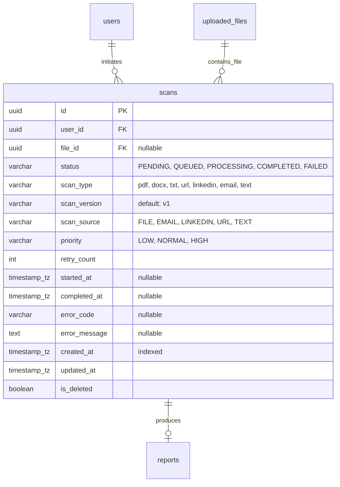
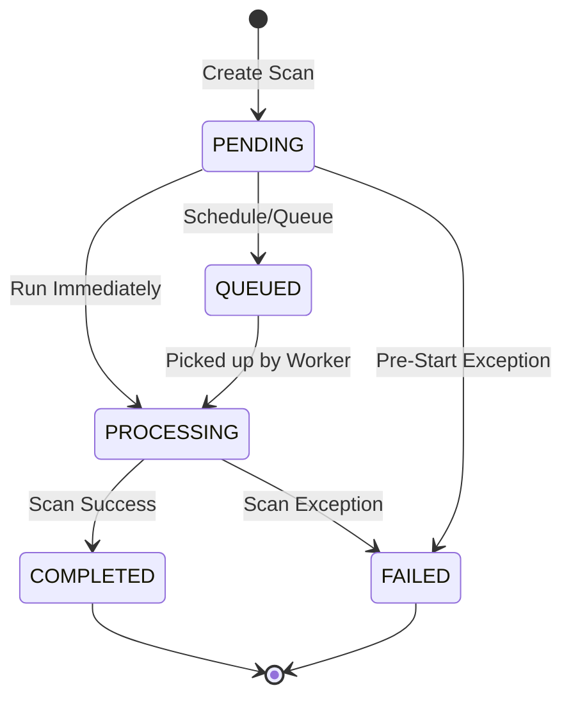
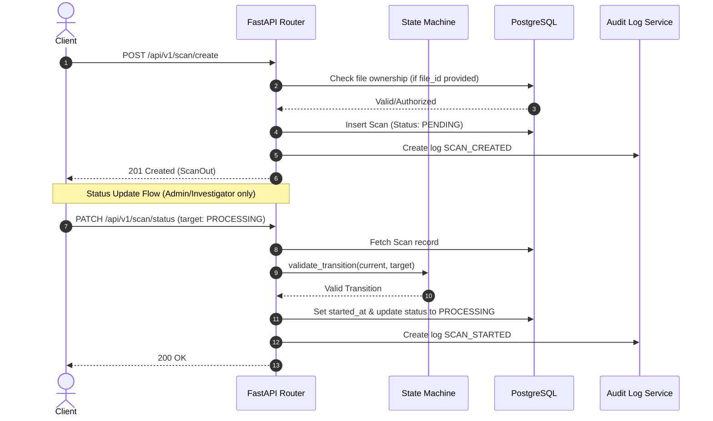

# Task 7: Scan Persistence Architecture Document

This document outlines the design, schema specification, lifecycle constraints, and API details for the **LEGITIFY** Scan Persistence system.

---

## 1. Database Entity Relationship Diagram (ERD)

Below is the database relationship mapping for the scans module:



---

## 2. Scan State Machine Diagram

Enforced status transition flow:



### Status Transition Matrix

| Current State | Target: PENDING | Target: QUEUED | Target: PROCESSING | Target: COMPLETED | Target: FAILED |
| :--- | :---: | :---: | :---: | :---: | :---: |
| **PENDING** | - | ✅ | ✅ | ❌ | ✅ |
| **QUEUED** | ❌ | - | ✅ | ❌ | ❌ |
| **PROCESSING** | ❌ | ❌ | - | ✅ | ✅ |
| **COMPLETED** | ❌ | ❌ | ❌ | - | ❌ |
| **FAILED** | ❌ | ❌ | ❌ | ❌ | - |

---

## 3. Scan Sequence Diagram



---

## 4. API Contract Details

### 4.1 Create Scan
* **Method**: `POST`
* **Path**: `/api/v1/scan/create`
* **Request Body**:
  ```json
  {
    "scan_type": "pdf",
    "scan_source": "FILE",
    "file_id": "f8a002bd-b8c2-4eb4-b9b3-059bc43a129f",
    "raw_input_text": null,
    "priority": "HIGH"
  }
  ```
* **Success Response (210 Created)**:
  ```json
  {
    "success": true,
    "message": "Scan record initialized.",
    "data": {
      "id": "c1f7b0e1-bbcb-402a-a92c-674b0f69a101",
      "user_id": "e0b57e7b-c9a9-4674-8b65-bfd045d4e101",
      "file_id": "f8a002bd-b8c2-4eb4-b9b3-059bc43a129f",
      "status": "PENDING",
      "scan_type": "pdf",
      "scan_version": "v1",
      "scan_source": "FILE",
      "priority": "HIGH",
      "retry_count": 0,
      "started_at": null,
      "completed_at": null,
      "error_code": null,
      "error_message": null,
      "created_at": "2026-06-15T16:32:00Z",
      "updated_at": "2026-06-15T16:32:00Z"
    },
    "errors": [],
    "request_id": "02bdc142-b9e7-494b-bf0d-6e7b4b1a4cb0"
  }
  ```

### 4.2 Get Scan History
* **Method**: `GET`
* **Path**: `/api/v1/scan/history`
* **Query Parameters**:
  * `page` (default: 1)
  * `limit` (default: 20)
  * `sort` (default: "created_at")
  * `order` (default: "desc")
  * `status` (optional filter)
  * `scan_type` (optional filter)
  * `start_date` / `end_date` (optional range filters)
* **Success Response (200 OK)**:
  ```json
  {
    "success": true,
    "message": "Scan history retrieved.",
    "data": {
      "scans": [ ... ],
      "total": 5,
      "page": 1,
      "limit": 2
    },
    "errors": [],
    "request_id": "02bdc142-b9e7-494b-bf0d-6e7b4b1a4cb2"
  }
  ```

---

## 5. Performance and Scaling Considerations

1. **Composite Database Indexes**:
   To accelerate dashboard query performances, we added specific index definitions:
   * `ix_scans_user_id`: Optimizes the basic query isolation (user scope).
   * `ix_scans_status`: Speeds up state filters.
   * `ix_scans_scan_type`: Accelerates source category queries.
   * `ix_scans_created_at`: Optimizes history ordering and timestamp lookups.
2. **Read/Write Segregation**:
   As scan records scale, the query load for `/history` should read from database read-replicas, while task managers write status updates directly to the writer node.

---

## 6. Future Queue Integration Strategy

As the platform scales to Phase 6, the scan state machine will seamlessly integrate with an asynchronous task queue:

```
FastAPI Server (POST /create)
      │
      ▼
DB Scan (Status: PENDING)
      │
      ▼
Message Broker (RabbitMQ / Redis)
      │
      ▼
Celery / Background Workers (Status -> PROCESSING)
      │
      ├─► Analysis Layer (Doc, Domain, Company)
      ▼
DB Scan (Status -> COMPLETED / FAILED)
```

1. **Locking**: Workers will use distributed lock management (e.g. Redlock on Redis) to prevent multiple execution tasks for the same `scan_id`.
2. **Idempotence**: Scan handlers will verify `retry_count` and state parameters before re-triggering engines.
