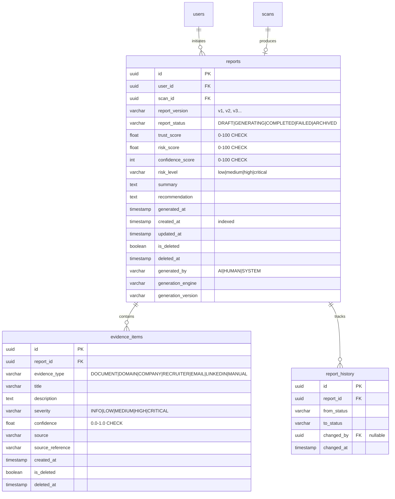
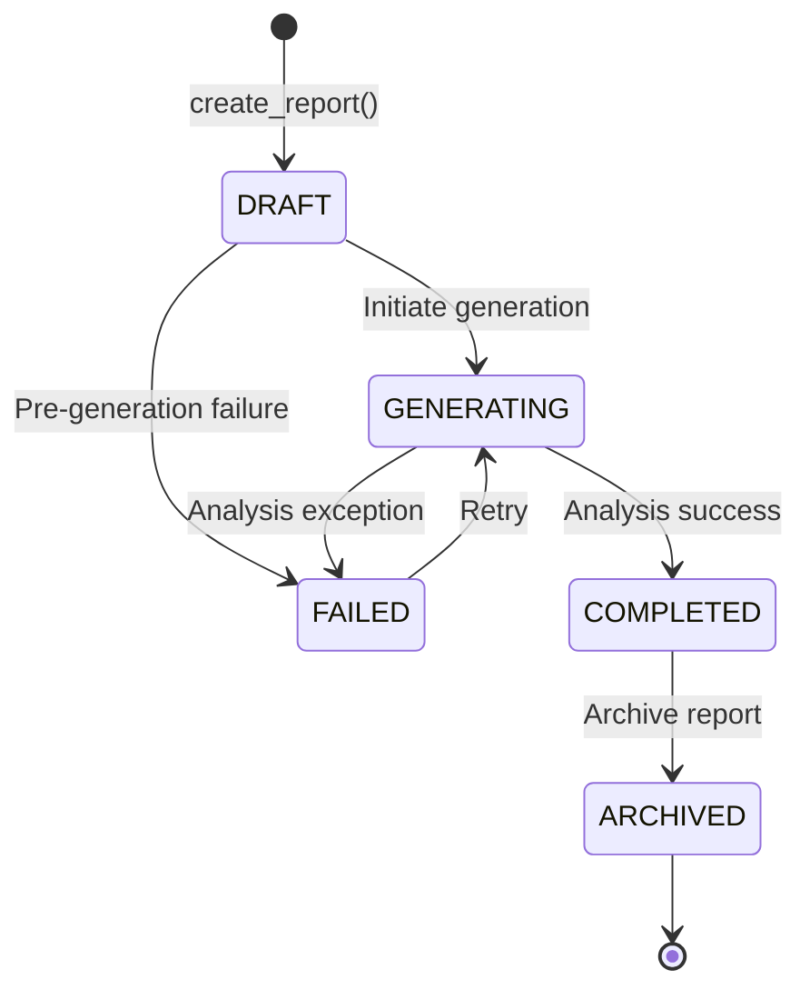
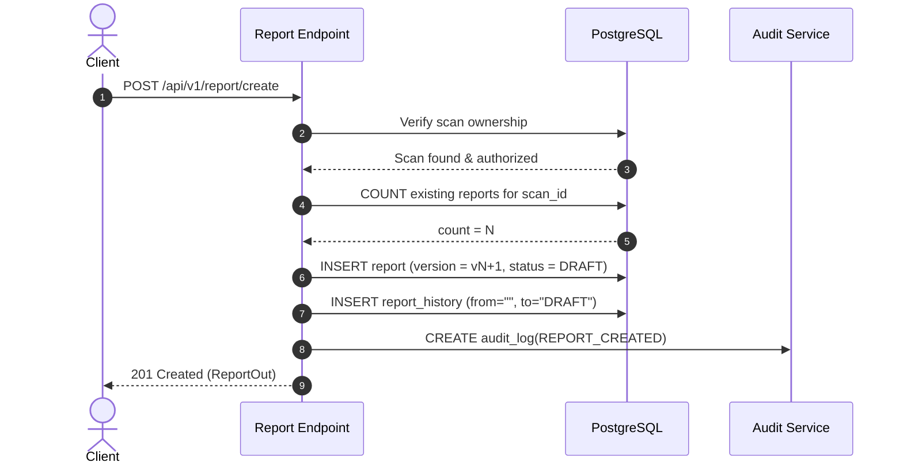
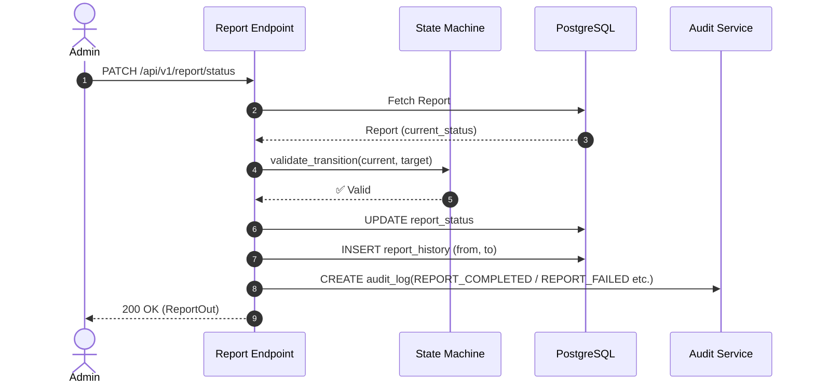

# TASK 8 – Report Persistence Enterprise Architecture

This document specifies the design, database schema, API contracts, security controls, and future AI integration architecture for the **LEGITIFY** Report Persistence layer.

---

## 1. Architecture Overview

The Report Persistence system is the **central data substrate** of the LEGITIFY platform. Every future AI analysis engine, trust scoring computation, and frontend dashboard widget reads from or writes into this layer.

Design philosophy:
* **Store first, analyze later** — no AI logic is embedded in the persistence layer.
* **Immutable snapshots** — completed reports are locked and never overwritten.
* **Version-controlled** — report regeneration creates a new version, not a modification.
* **Audit-ready** — every status transition creates two durable records: `report_history` and `audit_log`.
* **Future-proof** — fields like `generated_by`, `generation_engine`, `generation_version` are reserved for future AI agent integration.

---

## 2. Database Entity Relationship Diagram (ERD)



---

## 3. Report State Machine



### 3.1 State Transition Matrix

| From \ To | DRAFT | GENERATING | COMPLETED | FAILED | ARCHIVED |
|:---|:---:|:---:|:---:|:---:|:---:|
| **DRAFT** | – | ✅ | ❌ | ✅ | ❌ |
| **GENERATING** | ❌ | – | ✅ | ✅ | ❌ |
| **FAILED** | ❌ | ✅ | ❌ | – | ❌ |
| **COMPLETED** | ❌ | ❌ | – | ❌ | ✅ |
| **ARCHIVED** | ❌ | ❌ | ❌ | ❌ | – |

### 3.2 COMPLETED Immutability Rule

Once a report reaches `COMPLETED`, the following fields are **permanently locked**:
- `trust_score`
- `risk_score`
- `confidence_score`
- `summary`
- `recommendation`

Any modification attempt returns `400 Bad Request: "Report is completed and immutable."`.

---

## 4. Sequence Diagrams

### 4.1 Create Report



### 4.2 Status Transition



---

## 5. API Contracts

### 5.1 POST `/api/v1/report/create`
- **Auth**: Any authenticated user
- **ACL**: Scan must belong to caller (or caller must be admin/investigator)
- **Request**:
  ```json
  {
    "scan_id": "uuid",
    "trust_score": 72.5,
    "risk_score": 27.5,
    "confidence_score": 85,
    "risk_level": "medium",
    "summary": "Analysis complete.",
    "recommendation": "Review recruiter credentials.",
    "generated_by": "HUMAN"
  }
  ```
- **Response** `201`:
  ```json
  {
    "success": true,
    "message": "Report record initialised.",
    "data": { "id": "...", "report_version": "v1", "report_status": "DRAFT", ... },
    "errors": [],
    "request_id": "..."
  }
  ```

### 5.2 GET `/api/v1/report/{id}`
- **Auth**: Owner | Admin | Investigator
- **Audit**: Logs `REPORT_VIEWED`
- **Response** `200`: Standard `ReportOut` envelope

### 5.3 GET `/api/v1/report/`
- **Auth**: Any authenticated user (scoped to own reports; admins/investigators see all)
- **Filters**: `report_status`, `risk_level`, `min_trust_score`, `max_trust_score`, `min_risk_score`, `max_risk_score`, `start_date`, `end_date`
- **Sorting**: `sort` (field name), `order` (`asc` | `desc`)
- **Pagination**: `page`, `limit`
- **Response** `200`:
  ```json
  {
    "success": true,
    "data": { "total": 42, "page": 1, "limit": 20, "reports": [...] }
  }
  ```

### 5.4 PATCH `/api/v1/report/status`
- **Auth**: Admin | Investigator only
- **Validates**: State machine transition
- **Request**:
  ```json
  { "report_id": "uuid", "status": "COMPLETED" }
  ```

### 5.5 GET `/api/v1/report/{id}/evidence`
- **Auth**: Owner | Admin | Investigator
- **Response** `200`: Evidence items list with totals

### 5.6 POST `/api/v1/report/{id}/evidence`
- **Auth**: Admin | Investigator only
- **Blocked on**: ARCHIVED reports
- **Audit**: Logs `EVIDENCE_ADDED`
- **Request**:
  ```json
  {
    "evidence_type": "DOMAIN",
    "title": "Suspicious WHOIS registration",
    "description": "Domain registered 3 days before offer letter.",
    "severity": "HIGH",
    "confidence": 0.92,
    "source": "WHOIS"
  }
  ```

### 5.7 GET `/api/v1/report/{id}/export`
- **Extension Point** — Not yet implemented
- Accepts `format`: `pdf` | `json` | `audit`
- Returns: `200` with `success: false` and `"not yet implemented"` message

---

## 6. Performance Indexes

| Index | Type | Purpose |
|:---|:---|:---|
| `reports.user_id` | Single | Fast user-scoped report fetches |
| `reports.scan_id` | Single | Scan-to-report linkage lookups |
| `reports.trust_score` | Single | Score range filtering |
| `reports.risk_score` | Single | Score range filtering |
| `reports.report_status` | Single | Status dashboard queries |
| `reports.created_at` | Single | Temporal sorting |
| `(user_id, created_at)` | Composite | Dashboard history pagination |
| `(report_status, created_at)` | Composite | Admin status queue queries |
| `(scan_id, report_status)` | Composite | Scan-specific report lookups |

---

## 7. Security Controls

| Layer | Mechanism |
|:---|:---|
| Authentication | JWT access tokens, decoded via `get_current_user` dependency |
| Role Enforcement | `RoleChecker` – restricts status patches and evidence addition to `admin`/`investigator` |
| Ownership Enforcement | Every report fetch checks `report.user_id == current_user.id` or role bypass |
| Soft Delete | `is_deleted + deleted_at` – reports are never physically removed |
| Immutability | State machine rejects all non-`ARCHIVED` transitions from `COMPLETED` |
| Evidence ACL | Evidence inherits report ownership – same ACL applies |
| Audit Trail | All key events logged to `audit_logs` table with IP, user, and payload |

---

## 8. Future AI Integration Design

The `reports` table includes the following AI-readiness fields (reserved, not yet used):

| Field | Example Values | Purpose |
|:---|:---|:---|
| `generated_by` | `AI`, `HUMAN`, `SYSTEM` | Track who/what generated the report |
| `generation_engine` | `langraph-v1`, `bert-classifier` | Which AI model generated it |
| `generation_version` | `1.0.0`, `2.3.1` | Model version for reproducibility |

Future AI agents (LangGraph, BERT classifiers, etc.) will:
1. Create reports with `generated_by = "AI"` and appropriate `generation_engine`.
2. Add evidence rows into `evidence_items` via the `POST /evidence` endpoint using the `DOCUMENT`, `DOMAIN`, `COMPANY` source types.
3. Transition status from `GENERATING → COMPLETED` upon successful analysis.
4. The evidence table is designed as the **AI evidence store** — each finding is a structured row with `confidence`, `severity`, and `source_reference`.

---

## 9. Test Coverage Summary

| Test | Description | Status |
|:---|:---|:---:|
| `test_create_report_success` | Create report, verify DRAFT status & audit log | ✅ |
| `test_create_report_scan_not_found` | 404 for nonexistent scan | ✅ |
| `test_create_report_acl_other_user_scan` | 403 when another user's scan | ✅ |
| `test_report_versioning` | Creates v1, v2, v3 sequentially | ✅ |
| `test_get_report_owner_access` | Owner can read own report, audit VIEWED logged | ✅ |
| `test_get_report_forbidden_for_other_user` | 403 for unauthorized user | ✅ |
| `test_get_report_admin_access` | Admin can read any report | ✅ |
| `test_get_report_not_found` | 404 for missing report | ✅ |
| `test_report_status_transitions_valid` | DRAFT→GENERATING→COMPLETED→ARCHIVED + history check | ✅ |
| `test_report_status_invalid_transition` | DRAFT→ARCHIVED blocked (400) | ✅ |
| `test_report_status_forbidden_for_student` | Students blocked from status patch (403) | ✅ |
| `test_report_failed_retry` | FAILED→GENERATING retry path works | ✅ |
| `test_completed_report_state_machine_immutability` | All invalid transitions from COMPLETED blocked | ✅ |
| `test_add_and_get_evidence` | Evidence added by admin, retrieved by owner | ✅ |
| `test_evidence_student_cannot_add` | Students blocked from adding evidence (403) | ✅ |
| `test_evidence_acl_other_user_cannot_view` | 403 for another user's evidence | ✅ |
| `test_evidence_archived_report_blocks_addition` | Evidence blocked on ARCHIVED report (400) | ✅ |
| `test_report_history_pagination_and_filters` | Pagination, status/risk/score filters verified | ✅ |
| `test_admin_can_see_all_users_reports` | Admins see all users' reports | ✅ |
| `test_report_history_records_all_transitions` | 5 history rows for 4 transitions verified | ✅ |
| `test_soft_delete_report_not_returned` | Soft-deleted reports hidden from API | ✅ |
| `test_export_endpoint_placeholder` | Export stubs return not-implemented gracefully | ✅ |
| `test_export_invalid_format` | Bad export format returns 400 | ✅ |

**Total: 23/23 report tests + 16 existing tests = 39/39 passing. Coverage: 90%.**
