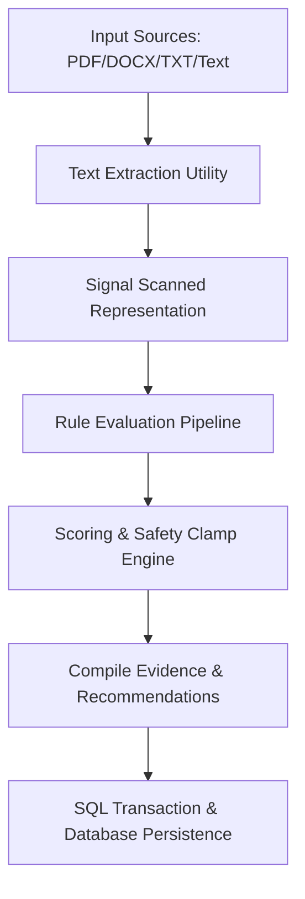

# LEGITIFY Trust Engine V1 Documentation

This document describes the design, implementation, and security controls for the rule-based, explainable, and deterministic **Trust Engine V1 (Enterprise Fraud Intelligence Core)**.

---

## 1. Architectural Overview

Trust Engine V1 serves as the modular decision-making core for evaluating the legitimacy of job offers, internship listings, recruiter communications, and domains in the LEGITIFY platform.

### Key Principles
- **Explainable & Deterministic**: Output results must be 100% reproducible. Every trust score computation is mapped directly to a set of rules with explicit audit logs.
- **Future Ready**: The architecture isolates parsing, scoring, and databases to allow future AI Agents, WHOIS API Integrations, and Social Scrapers to slide in without refactoring core models.
- **Strict Data Integrity**: Deductions must not be based on fabricated or mock data (e.g. unknown domain age results in a neutral status instead of penalty).

---

## 2. Confidence & Signal Classification Framework

Every rule evaluated by the engine is assigned a **Confidence level** (`LOW`, `MEDIUM`, or `HIGH`). This rating determines its weight and impacts how the final Trust Score classification behaves.

| Severity / Confidence | Suggested Weight Range | Fired Signal Example | Reason |
|---|---|---|---|
| **HIGH** | `-20` to `-50` | `TRAINING_FEE_REQUESTED`   `SECURITY_DEPOSIT_REQUESTED`   `EMAIL_DOMAIN_MISMATCH`   `BROKEN_WEBSITE`   `NO_CONTACT_INFORMATION` | Direct evidence of standard job scams (e.g., upfront payment requests, domain spoofing). |
| **MEDIUM** | `-10` to `-20` | `FREE_EMAIL_RECRUITER`   `NO_COMPANY_ADDRESS`   `NO_CAREERS_PAGE`   `HTTPS_MISSING` | Structural red flags that require additional supporting evidence. |
| **LOW** | `-1` to `-10` | `RARE_TLD`   `GRAMMAR_ISSUES`   `URGENT_LANGUAGE_DETECTED`   `MISSING_SOCIAL_LINKS` | Stylistic, auxiliary, or domain configuration details that carry high false-positive rates on their own. |

---

## 3. Scoring & Risk Level Principles

### Trust Score Formula
- **Base Score**: `100.0`
- **Deduction Formula**:
  $$\text{Trust Score} = \max\left(0, \min\left(100, \text{Base Score} + \sum \text{Score Changes}\right)\right)$$
- **Risk Score**:
  $$\text{Risk Score} = 100.0 - \text{Trust Score}$$

### Risk Level Ranges
- **LOW Risk**: $\text{Trust Score} \ge 70$
- **MEDIUM Risk**: $40 \le \text{Trust Score} < 70$
- **HIGH Risk**: $15 \le \text{Trust Score} < 40$
- **CRITICAL Risk**: $\text{Trust Score} < 15$

### Scoring Safety Clamping (Scoring Principle)
> [!IMPORTANT]
> **Safety Override**: A company must **never** be classified as High or Critical Risk solely based on LOW confidence signals (e.g. only having a `RARE_TLD` and `GRAMMAR_ISSUES` resulting in a score deduction, but no MEDIUM or HIGH confidence signals).
> In such instances, the system automatically overrides the risk level back to **MEDIUM** to avoid flagging legitimate entities due to style or re-branding choices.

---

## 4. Database Schema Extensions

### `trust_score_breakdowns` Table
This table stores a granular audit trail for every trust analysis execution.

| Column | Type | Constraints | Description |
|---|---|---|---|
| `id` | `UUID` | `PRIMARY KEY` | Unique ID of breakdown record |
| `report_id` | `UUID` | `FOREIGN KEY` (Cascade) | Reference to Report |
| `rule_name` | `VARCHAR(255)` | `NOT NULL` | Fired rule signature |
| `rule_category` | `VARCHAR(100)` | `NOT NULL` | Category grouping |
| `weight` | `FLOAT` | `NOT NULL` | Standard weight boundary |
| `score_change` | `FLOAT` | `NOT NULL` | Actual score impact |
| `confidence` | `VARCHAR(20)` | `CHECK(confidence IN ('LOW', 'MEDIUM', 'HIGH'))` | Engine confidence |
| `reason` | `TEXT` | `NOT NULL` | Plain text reason |
| `source` | `VARCHAR(100)` | `NOT NULL` | Rule source (e.g., DNS, Text Parser) |
| `created_at` | `TIMESTAMPTZ` | `NOT NULL` | Created timestamp |

---

## 5. Auditability & User Presentation

Every decision made by the Trust Engine is fully inspectable on the UI. The `/report/[id]` page renders the **Trust Score Audit Logs** table directly:
1. **Rule Name**: Plain text description of the triggered check.
2. **Category**: Dimension check (e.g., `DOMAIN_SIGNALS`, `RECRUITER_SIGNALS`).
3. **Confidence**: Colored indicator badge (`LOW`, `MEDIUM`, `HIGH`).
4. **Source**: Origin of signal (e.g. Email Headers, PDF Parser).
5. **Reason**: Concrete explanation (e.g., "Registration fee of $200 requested").
6. **Score Impact**: Specific numerical change (e.g. `-40.0`).
